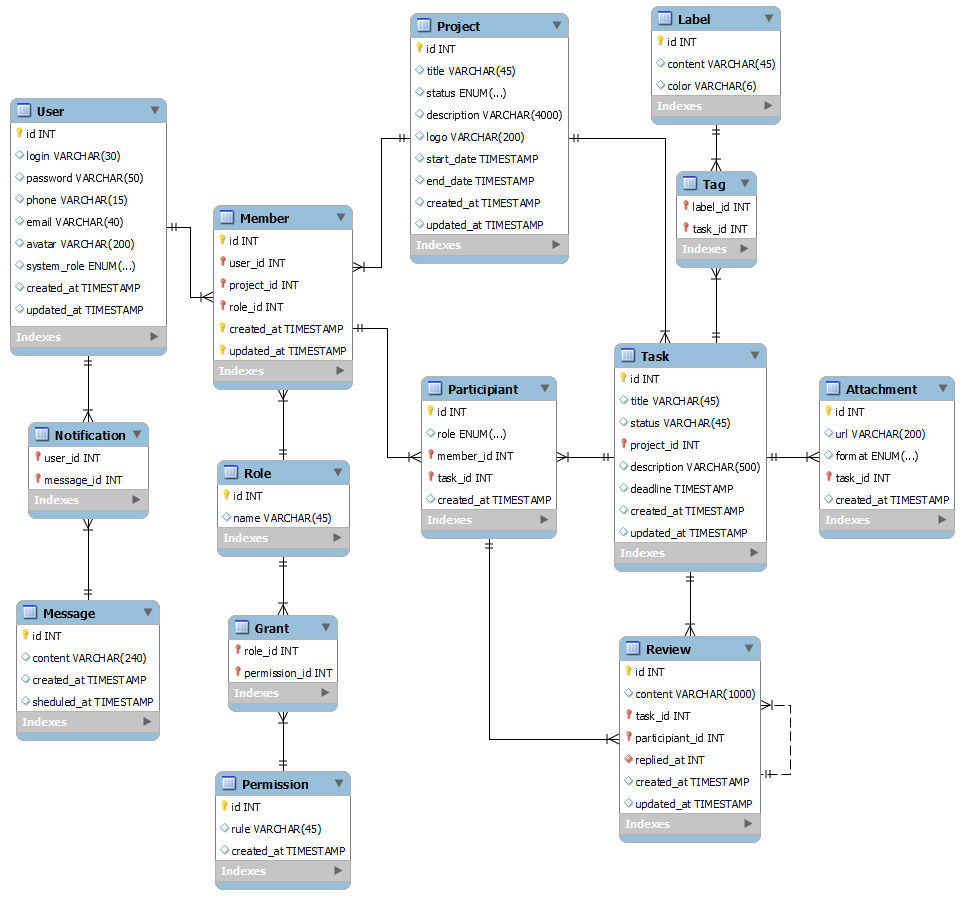

# Проєктування бази даних

## Модель бізнес об'єктів

@startuml

entity Message #0096FF
entity User #0096FF
entity Notification #0096FF
entity Role #0096FF
entity Grant #0096FF
entity Permission #0096FF

entity Label #0096FF
entity Tag #0096FF
entity Task #0096FF
entity Attachment #0096FF
entity Review #0096FF
entity Project #0096FF
entity ProjectTemplate #0096FF
entity Participant #0096FF
entity Member #0096FF

entity Role.name

entity Permission.role

entity Message.scheduled_at
entity Message.content

entity User.login
entity User.email
entity User.system_role
entity User.password

User "1,1"-r-"0,*" Member
Member "0,*    "-d-"1,1" Role
Role "1,1"-d-"     0,*"  Grant
Grant "0,*"-d-"       1,1" Permission

User "1,1"-d-"0,*" Notification
Message "1,1   "-u- "0,*" Notification

Role.name -l-* Role

Permission.role -u-* Permission

Message.scheduled_at -u-* Message
Message.content -u-* Message

User.email -d-* User
User.login -d-* User
User.system_role -r-* User
User.password -u-* User

entity Label.content

entity Task.deadline
entity Task.title
entity Task.description
entity Task.status

entity Attachment.url
entity Attachment.format

entity Review.content

entity Project.title
entity Project.description
entity Project.status

Label "1,1"-d-"0,*" Tag
Tag "0,*"-d-"1,1" Task
Task "       1,1"-d-"0,*" Attachment
Task "1,1"-r-"       0,*" Review
Participant "1,1"-u-"0,*" Review
Review "0,*"-"   0,1" Review
Task "0,*    "-l-"1,1" Project
Task "1,1 "-d-"0,*" Participant
ProjectTemplate -u-|> Project
Member "0,*"-r-"1,1" Project
Member "1,1"-r-"0,*" Participant

Label.content -d-* Label

Task.deadline -d-* Task
Task.title -d-* Task
Task.description -d-* Task
Task.status -d-* Task

Attachment.url -u-* Attachment
Attachment.format -u-* Attachment

Review.content -u-* Review

Project.title -d-* Project
Project.description -d-* Project
Project.status -d-* Project

@enduml

## ER-модель

@startuml

package AccountManage {
    entity User <<ENTITY>> { 
              id: int
              login: text
              password: text
              phone: text
              email: text
              avatar: image
              systemRole: enum
    }
}

package NotificationManage {
    entity Notification <<ENTITY>> {
    }

    entity Message <<ENTITY>> {
        id: int
        content: text
        scheduledAt: timestamp
    }
}

entity Member <<ENTITY>> {
    id: int
}

package PermissionManage {
    entity Role <<ENTITY>> {
        id: int
        name: text
    }

administrator .d.> Role: instanceOf
manager .d.> Role: instanceOf
ordinary_user .d.> Role: instanceOf

    entity Grant <<ENTITY>> {
    }

    entity Permission <<ENTITY>> {
        id: int
        rule: text
    }
}
entity Participant <<ENTITY>> {
    id: int
    role: enum
}

package ProjectManage {
    entity Project <<ENTITY>> { 
              id: int
              title: text
              status: enum
              description: text
              logo: image
              startDate: timestamp
              endDate: timestamp
    }
  
    entity ProjectTemplate <<ENTITY>> {
    }

}

package TaskManage {
    entity Task <<ENTITY>> { 
              id: int
              title: text
              status: text
              description: text
              deadline: timestamp
    }

    entity Tag <<ENTITY>> {
    }

    entity Label <<ENTITY>> {
               id: int
               content: text
    }
}

entity Attachment <<ENTITY>> {
                id: int
                url: image
                format: enum
}

package ReviewManage {
    entity Review <<ENTITY>> { 
              id: int
              content: text
    }
}

User "1,1" -l-- "0,*" Notification
User "1,1" -r-- "0,*" Member
Notification "0,*" -d-- "1,1" Message

Member "0,*" -d-- "1,1" Role
Member "1,1\n" -r-- "0,*" Participant
Role "1,1" -d-- "0,*"  Grant
Grant "0,*" -d-- "1,1" Permission

Project "1,1" -d-- "0,*" Member
Project o-l- ProjectTemplate

Task "0,*" -r-- "1,1" Project
Task "1,1" -r-- "0,*" Attachment
Task "1,1" -d-- "0,*" Tag
Tag "0,*" -d-- "1,1" Label

Review "0,*" -r-- "1,1" Task
Review "0,*" -r-- "1,1" Participant

@enduml

## Реляційна схема

