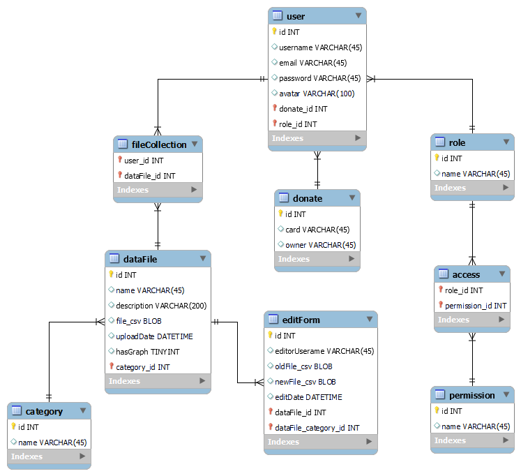

# Проєктування бази даних

### В рамках проекту розробляється: 

## Модель бізнес-об'єктів 

@startuml 

entity User
entity User.id #ffffff 
entity User.username #ffffff
entity User.email #ffffff
entity User.password #ffffff 
entity User.avatar #ffffff

entity Access

entity DataFile
entity DataFile.id #ffffff 
entity DataFile.name #ffffff 
entity DataFile.description #ffffff 
entity DataFile.file_csv #ffffff 
entity DataFile.uploadDate #ffffff
entity DataFile.hasGraph #ffffff

entity EditForm
entity EditForm.id #ffffff
entity EditForm.editorUsername #ffffff
entity EditForm.oldFile_csv #ffffff
entity EditForm.newFile_csv #ffffff
entity EditForm.editDate #ffffff

entity Category
entity Category.id #ffffff 
entity Category.name #ffffff 

entity Role
entity Role.name #ffffff
entity Role.id #ffffff
object RegisteredUser #ffffff
object Editor #ffffff
object Admin #ffffff

entity FileCollection

entity Permission
entity Permission.id #ffffff
entity Permission.name #ffffff
object Read #ffffff
object Edit #ffffff
object Download #ffffff
object Upload #ffffff
object Delete #ffffff
object ManageEditors #ffffff

entity Donate
entity Donate.type #ffffff

Donate "1,1" -u- "0,*" User
Role "1,1" -r- "0,*" User

RegisteredUser ..> Role : instanceOf
Editor ..> Role : instanceOf
Admin ..> Role : instanceOf

Access "0,*" -u- "0,1"  Role
Permission "0,1" -u- "0,*"  Access
Permission.name -l-* Permission
Permission.id -r-* Permission
Read .u.> Permission : instanceOf
Edit .u.> Permission : instanceOf
Download .u.> Permission : instanceOf
Upload .u.> Permission : instanceOf
Delete .u.> Permission : instanceOf
ManageEditors .u.> Permission : instanceOf

User "1,1" ---d- "0,*" FileCollection

FileCollection "0,*" -d-- "1,1" DataFile

EditForm "0,*" --u- "1,1" DataFile
Category "1,1" --u- "0,*" DataFile

User.id -d-* User 
User.username -d-* User
User.email -d-* User 
User.password -d-* User 
User.avatar -d-* User
 
DataFile.id -d-* DataFile
DataFile.name -d-* DataFile
DataFile.description -r-* DataFile
DataFile.file_csv -d-* DataFile
DataFile.uploadDate -d-* DataFile
DataFile.hasGraph -d-* DataFile

Category.id -u-* Category
Category.name -u-* Category

EditForm.id -r-* EditForm
EditForm.editorUsername -l-* EditForm
EditForm.oldFile_csv -u-* EditForm
EditForm.newFile_csv -u-* EditForm
EditForm.editDate -u-* EditForm

Role.name -u-* Role
Role.id -r-* Role

Donate.type -l-* Donate

@enduml 

## ER-модель

@startuml 

namespace AccountManagement {

entity User <<ENTITY>> {
    id: INT
    username: TEXT
    email: TEXT
    password: TEXT
    avatar: TEXT
}
}

namespace AccessPolicy {

entity FileCollection

entity Role <<ENTITY>> {
    id: INT
    name: TEXT
}
object RegisteredUser #ffffff
object Editor #ffffff
object Admin #ffffff

entity Access

entity Permission <<ENTITY>> {
    name: TEXT
    id: INT
}
object Read #ffffff
object Edit #ffffff
object Download #ffffff
object Upload #ffffff
object Delete #ffffff
object ManageEditors #ffffff

entity Donate <<ENTITY>> {
    type: TEXT
}
}

namespace WorkWithData {

entity DataFile <<ENTITY>> {
    id: INT 
    name: TEXT 
    description: TEXT 
    file_csv: TEXT
    uploadDate: DATE
    hasGraph: BOOL  
}

entity Category <<ENTITY>> {
    id: INT
    name: TEXT
}

entity EditForm <<ENTITY>> {
    id: INT
    editorUsername: TEXT
    oldFile_csv: TEXT
    newFile_csv: TEXT
    editDate: DATE
}

}

Donate "1,1" -u- "0,*" User
Role "1,1" -r- "0,*" User

RegisteredUser ..> Role : instanceOf
Editor ..> Role : instanceOf
Admin ..> Role : instanceOf

Access "0,*" -u- "0,1"  Role
Permission "0,1" -u- "0,*"  Access
Read .u.> Permission : instanceOf
Edit .u.> Permission : instanceOf
Download .u.> Permission : instanceOf
Upload .u.> Permission : instanceOf
Delete .u.> Permission : instanceOf
ManageEditors .u.> Permission : instanceOf

User "1,1" ---d- "0,*" FileCollection

FileCollection "0,*" -d- "1,1" DataFile

EditForm "0,*" -u- "1,1" DataFile
Category "1,1" -u- "0,*" DataFile

@enduml 

## Опис моделей

### User

Сутність, яка являє собою обліковий запис користувача з особистою інформацією.

<b>Атрибути:</b>

- id - ідентифікаційний номер користувача.
- username - ім'я користувача в системі.
- email - поштова скринька користувача.
- password - пароль для входу в обліковий запис користувача.
- avatar - фотографія профілю користувача.

### DataFile

Сутність, яка являє собою файл з набором певних статистичних даних.

<b>Атрибути:</b>

- id - ідентифікаційний номер файлу.
- name - назва файлу.
- description - короткий опис змісту файлу.
- file_csv - формат відображення даних.
- uploadDate - дата завантаження файлу.
- hasGraph - чи є візуалізація графіком.

### EditForm

Сутність, яка являє собою форму для редагування даних у файлі.

<b>Атрибути:</b>

- id - ідентифікаційний номер форми.
- editorUsername - ім'я редактора, який вніс зміни у файл.
- oldFile_csv - старий незмінений файл.
- newFile_csv - новий змінений файл.
- editDate - змінені дані.

### Category

Сутність, яка являє собою категорію до якої належить файл даних.

<b>Атрибути:</b>

- id - ідентифікаційний номер категорії.
- name - назва категорії.

### Role

Сутність, яка являє собою роль користувача в системі.

<b>Атрибути:</b>

- id - ідентифікаційний номер ролі.
- name - назва ролі.

<b>Існують такі ролі:</b>

- RegisteredUser - зареєстрований користувач.
- Editor - редактор.
- Admin - адміністратор.

### Permission

Сутність, яка являє собою набір дозволів користувача в системі.

<b>Атрибути:</b>

- id -  ідентифікаційний номер дозволу.
- name - назва дозволу.

<b>Існують такі дозволи:</b>

- Read - переглядати файл з набором даних у системі.
- Edit - змінювати файл з набором даних у системі, якщо є відповідний дозвіл для ролі.
- Download - скачувати файл з набором даних із системи на локальний комп'ютер.
- Upload - завантажувати файл з набором даних у систему, якщо є відповідний дозвіл для ролі.
- Delete - видаляти файл з набором даних із системи, якщо є відповідний дозвіл для ролі.
- ManageEditors - управляти редакторами системи, якщо є відповідний дозвіл для ролі.

### Donate

Сутність, яка являє собою систему для пожертвування певної кількості коштів.

<b>Атрибути:</b>

- type - тип донату.

### FileCollection

Сутність-асоціація, яка являє собою сукупність файлів з даними для користувача.

### Access

Сутність-асоціація, яка являє собою сукупність дозволів для певної ролі.

## Реляційна схема

