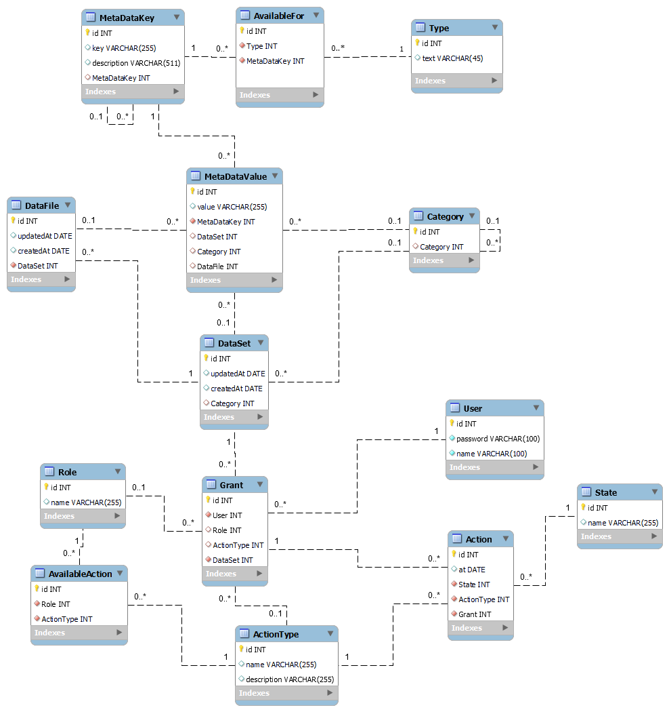

# Проєктування бази даних

В рамках проекту розробляється: 

- ER-модель

@startuml

entity DataSet {
    updatedAt: Date
    createdAt: Date
  
  }
  
  entity DataFile {
    updatedAt: Date
    createdAt: Date
  }
  
  entity Type {
    name: TEXT
  }
  
  entity AvailableFor {

  }
  
  entity AvailableAction {

  }
  

  entity MetaDataKey {
    key: TEXT
    description:TEXT
  }

  entity MetaDataValue {
    value: TEXT
  }

  entity Category {
    
  }
  
  
  
  entity User {
    name: TEXT
    password: TEXT
  }
  
  entity Grant {

  }

  entity Role {
    name: TEXT
  }

  entity State {
    name: TEXT
  }
  
  entity Action {
    at: DATE
  }
  
  entity ActionType {
    name: TEXT
    description:TEXT
  }

  DataSet "1,1" <-- "0,*" DataFile
  DataSet "0, 1" <-u- "0, *" MetaDataValue: DataSetRef
  DataFile "0, 1" <-u- "0, *" MetaDataValue: DataFileRef
  Category "0, 1" <-u- "0, *" MetaDataValue: CategoryRef
 
  MetaDataValue "0, *" -u-> "1, 1" MetaDataKey
  
  MetaDataKey "0, *" -u-> "0, 1" MetaDataKey: parentKey
  
  DataSet "0,*" --> "0,1" Category
  Category "0,1" <-- "0,*" Category
  
  DataSet "1,1" <-- "0,*" Grant
  Grant "0,*" --> "1, 1" User 
  Grant "0,*" --> "0, 1" Role
  Grant "0,*" --> "0, 1" ActionType
  
  AvailableFor "0,*"--> "1, 1" Type
  AvailableFor "0,*"--> "1, 1" MetaDataKey
  Role "1, 1" <- "0,*" AvailableAction
  AvailableAction "0,*" --> "1, 1"ActionType
  Action -u-> Grant
  Action -> State
  Action --> ActionType
  
@enduml

Пояснення до **ER-моделі**:

Задачі, які стоять перед нами:
1. Керування структурою датасета.
2. Супроводження датасетів метаданими.
3. Забезпечення доступу до датасетів.
---
1. Керування структурою датасета

Датасет - це колекція файлів, кожен файл відноситься до одного датасету, в зворотньому напрямку: датасет може складатись з будь-якої кількості файлів, включаючи можливість бути пустими, в тому випадку, коли при створенні датасету він ще не має жодних файлів.

Для того, щоб упорядкувати датасети, вони відносяться до категорій: датасет може мати одну категорію, причому, бувають ситуації, коли датасет не віднесений до жодної з категорій. Категорії являють собою ієрархічне дерево, вони  можуть мати або не мати надкатегорію.
 
---

2. Супроводження датасетів метаданими.

Важливо супроводжувати дані інформацією, яка буде характеризувати до якої області вони відносяться, хто їх створив, хто ними володіє і т.д. Для цього ми використовуємо метадані.

Є задекларовані  ключі метаданих, в них є поле як ключ, це може бути автор, колаборатор, ліцензія і т.д., є опис, який дозволяє нам зрозуміти сенс того чи іншого ключа. Ключем метаданих будуть помічені багато датасетів, тому між цими сутностями виникають відношення багато на багато, для того, щоб це вирішити між ними вставляється асоціююча сутність зі значенням MetaDataValue, яка показує, що до конкретного датасету відноситься конкретне значення ключа метаданих. 
Метаданими ми також супроводжуємо категорії та саме файли даних. Конкретне значення відноситься або до категорії, або до датасета, або до датафайлу. Для встановлення цих взаємозв’язків ми використовуємо посилання (CategoryRef, DataSetRef, DataFileRef).
Метадані можуть бути зібрані в ієрархічні структури, наприклад складні метадані будуть складатися з інших метаданих (наприклад автор буде складатися з ім’я, прізвища, контакту).

Таблиця Type: типи тих об'єктів які зберігаються у нас - це категорії, датасети та датафайли. Для того, щоб створювати користувацький інтерфейс потрібні певні правила, тобто потрібно визначити, які ключі метаданих для яких об’єктів доступні. Таблиця AvailableFor дозволяє визначити, які ключі до яких об’єктів можна застосовувати. Це дасть нам можливість визначити, які набори метаданих, доступні для опису різних типів об'єктів.

---

3.	Забезпечення доступу до датасетів.

У нас є користувачі, вони мають різні права доступу до датасетів, ці права укладені в об’єкті Grant. Кожен дозвіл зв’язаний з датасетом і конкретним користувачем. Типи операції укладені в ActionType (наприклад створити, оновити, видалити і т.д.). Підхід, коли кожному Grant’у відповідає один тип операції, один користувач та один датасет називається вибірковий підхід до формування авторизації доступу до ресурсів, але при великій кількості користувачів він стає занадто складним, в першу чергу для адміністратора, який виставляє ці права. Тому існує груповий підхід, він пов’язаний з тим, що типи операцій складаються в групи, які називають зазвичай ролями і Grant видається користувачу фактично як Role. Системі буде приходити запрос, в якому є тип операції, ідентифікатор користувача і об’єкт над яким ми хочемо виконувати дію, внаслідок чого система зможе перевірити існування Grant’а та чи відповідає йому та операція, яку просить виконати користувач і як результат система прийме рішення, чи давати доступ для виконання дії над об’єктом. Користувачам призначають Role і потім при необхідності йому призначаються додаткові можливості. Таким чином вирішується задача з розділенням прав доступа на різні об’єкти в базах (в нашому випадку це датасети, відносно яких визначаються можливі операції над ними і можливість формувати для кожного користувача AvailableAction).

Нам обов'язково потрібно підтримувати життєвий цикл, в залежності від того в якому стані знаходяться наші об'єкти, тобто на якій стадії життєвого циклу, вони повинні по-різному оброблятися, відображатися  нашою системою. Для того, щоб записати дії, які відбуваються над датасетом, вводиться таблиця Action (має атрибут Date, що дозволяє нам зафіксувати час зміни)), яке пов'язується, по-перше, з Grant’ом, тому що знаючи його ми можемо визначити користувача та дію, яку він виконува, по-друге, з станом (таблиця State), в який цей об’єкт буде переходити.

---

- реляційна схема

