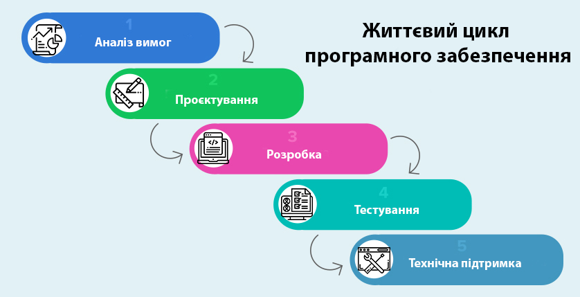
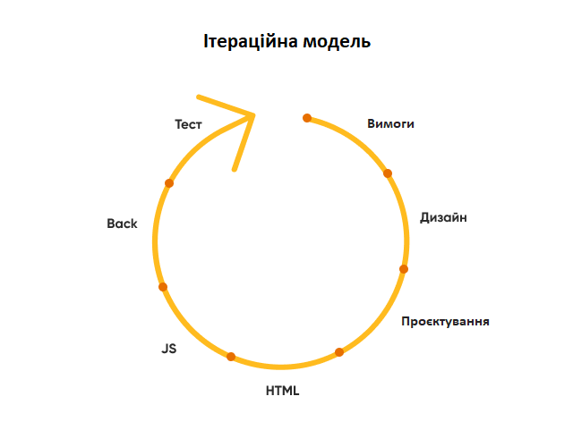
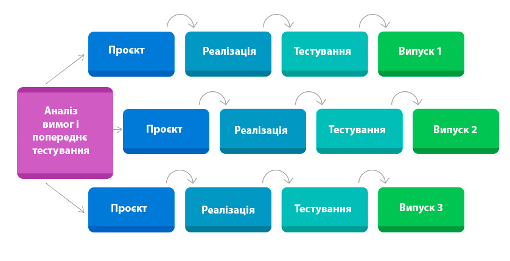
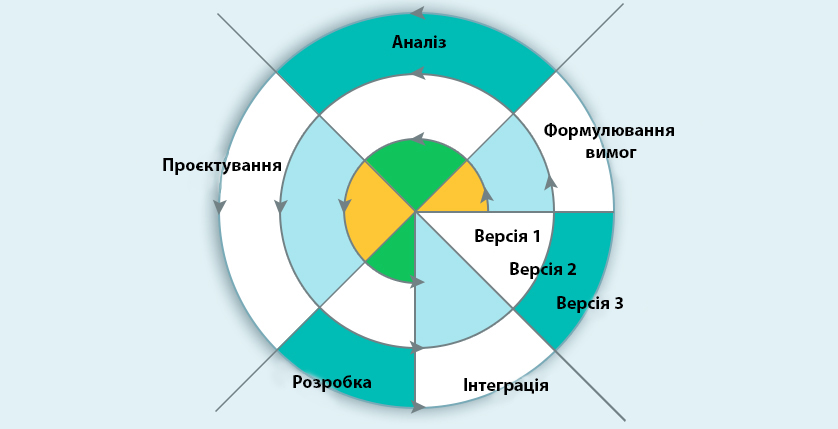
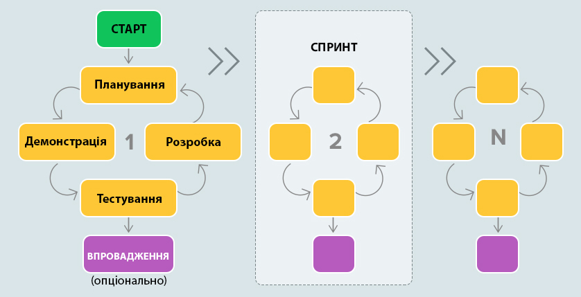
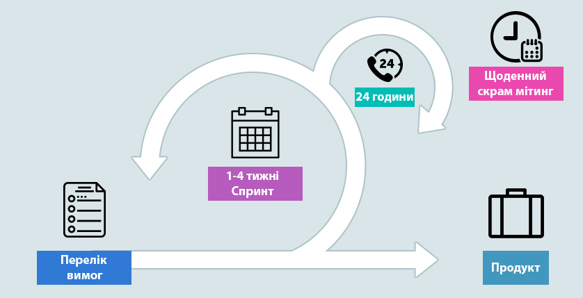
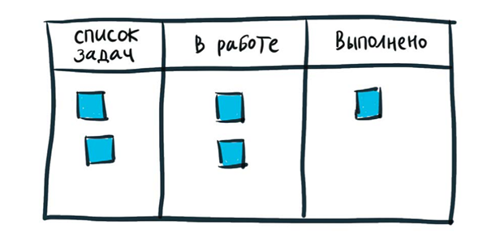
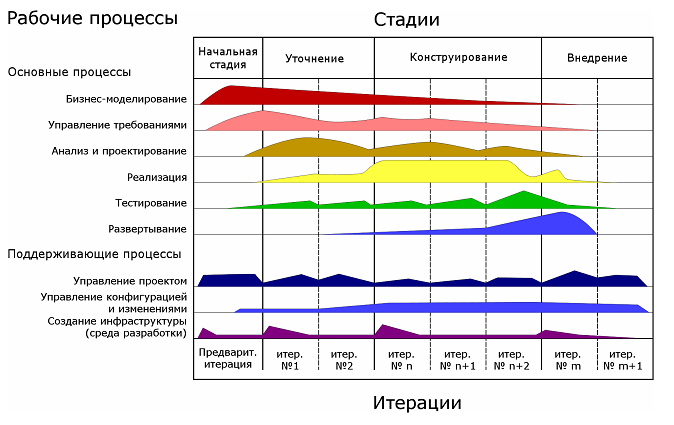

# Аналіз предметної області

## Вступ

В даному документі проводиться аналіз систем управління проєктами. Виділяються основні поняття, моделі вирішення завдання та проводиться порівняльна характеристика існуючих рішень завдання. Також виділені основні переваги та недоліки моделі.

## Основні визначення

[Система](https://en.wikipedia.org/wiki/System) — це група взаємодіючих або взаємопов’язаних елементів, які взаємодіють відповідно до набору правил, утворюючи єдине ціле. Система, оточена навколишнім середовищем і піддається його впливу. Вона визначається своїми межами, структурою та призначенням і виражається в своєму функціонуванні.

[Артефакт](https://uk.wikipedia.org/wiki/%D0%90%D1%80%D1%82%D0%B5%D1%84%D0%B0%D0%BA%D1%82_(UML)) - це в UML називають окремий шмат інформації, що використовується чи з'являється в процесі розробки програмного забезпечення. Це може бути файл з кодом, модель, частина документації, чи повідомлення електронної пошти або навіть нотатка, приклеєна до монітора.

[UML](https://uk.wikipedia.org/wiki/Unified_Modeling_Language) (англ. Unified Modeling Language) — уніфікована мова моделювання, використовується у парадигмі об'єктно-орієнтованого програмування. Є невід'ємною частиною уніфікованого процесу розробки програмного забезпечення.

[FAQ](https://uk.wikipedia.org/wiki/FAQ), F.A.Q. — підбірка часто задаваних питань на певну тему та відповідей на них.

[Система керування версіями](https://uk.wikipedia.org/wiki/%D0%A1%D0%B8%D1%81%D1%82%D0%B5%D0%BC%D0%B0_%D0%BA%D0%B5%D1%80%D1%83%D0%B2%D0%B0%D0%BD%D0%BD%D1%8F_%D0%B2%D0%B5%D1%80%D1%81%D1%96%D1%8F%D0%BC%D0%B8) — це система, що записує зміни у файл або набір файлів протягом деякого часу, так що ви зможете повернутися до певної версії пізнише.

[Мережевий протокол](https://deltahost.ua/ua/tipi-merezhevix-protokoliv-i-ih-priznachennya-http-ip-ssh-ftp-pop3-mac.html) — це комплекс установок, завдяки яким визначається і регулюється процес інформаційного обміну між комп’ютерами, підключеними до інтернету.

[TLS](https://www.vpnunlimited.com/ua/help/vpn-protocols/tls-protocol) або Transport Layer Security - це криптографічний протокол, який забезпечує конфіденційну та надійну передачу даних між двома взаємодіючими додатками.

[API](https://dev.ua/news/chto-takoe-api-prostym-yazykom) — це абривіатура «Application Programming Interface «(інтерфейс програмування додатків, програмний інтерфейс програми). Більшість великих компаній на певному етапі розробляють API для клієнтів або для внутрішнього використання.

[GitHub](https://uk.wikipedia.org/wiki/GitHub) — один з найбільших вебсервісів для спільної розробки програмного забезпечення. Існують безплатні та платні тарифні плани користування сайтом. Базується на системі керування версіями Git і розроблений на Ruby on Rails і Erlang компанією GitHub, Inc (раніше Logical Awesome).

[Модель](https://uk.wikipedia.org/wiki/%D0%9C%D0%BE%D0%B4%D0%B5%D0%BB%D1%8C) (від лат. modulus — «міра, аналог, зразок, взірець») — відтворення чи відображення об'єкту, задуму (конструкцій), опису чи розрахунків, що відображає, імітує, відтворює принципи внутрішньої організації або функціонування, певні властивості, ознаки чи/та характеристики об'єкта дослідження чи відтворення (оригіналу).

[Життєвий цикл програмного забезпечення](https://uk.wikipedia.org/wiki/%D0%A2%D0%B5%D1%81%D1%82%D1%83%D0%B2%D0%B0%D0%BD%D0%BD%D1%8F_%D0%BF%D1%80%D0%BE%D0%B3%D1%80%D0%B0%D0%BC%D0%BD%D0%BE%D0%B3%D0%BE_%D0%B7%D0%B0%D0%B1%D0%B5%D0%B7%D0%BF%D0%B5%D1%87%D0%B5%D0%BD%D0%BD%D1%8F) (ПЗ) – період часу, який починається з моменту прийняття рішення про необхідність створення програмного продукту і закінчується в момент його повного вилучення з експлуатації.

[Модель життєвого циклу ПЗ](https://edu-db.github.io/p2/3) - це структура, що визначає послідовність виконання і взаємозв'язок процесів, дій і задач упродовж життєвого циклу.

[Керування часом, тайм-менеджмент](https://uk.wikipedia.org/wiki/%D0%9A%D0%B5%D1%80%D1%83%D0%B2%D0%B0%D0%BD%D0%BD%D1%8F_%D1%87%D0%B0%D1%81%D0%BE%D0%BC) (від англ. time management) — сукупність методик оптимальної організації часу для виконання поточних задач, проектів та календарних подій.

[Спринт](https://ucode.world/shho-take-skram-i-yak-tse-pratsyuye/) — це короткий часовий інтервал, протягом якого scrum-команда виконує заданий обсяг роботи .

[Лендінг](https://hostiq.ua/blog/ukr/what-is-landing/) — це невеликий односторінковий сайт, який закликає клієнта зробити одну конкретну дію: наприклад, підписатися на розсилку, купити навчальний курс або замовити соковижимач.

[MVP](https://evergreens.com.ua/ua/articles/software-development-metodologies.html) — така версія продукту, що виконує свою головну функцію і при цьому її не відхиляють клієнти і визнають її корисність.

[Канбан-дошка](https://rozetka.com.ua/ua/240088285/p240088285/) — один з інструментів, який може використовуватися при впровадженні методу управління розробкою «Канбан». Такі дошки можна як варіацію на тему традиційних канбан-карток. Замість сигнальних карток, які зазвичай позначають потребу або пропускну здатність, разом із дошкою використовуються магніти, пластикові фішки, кольорові шайби або стікери для представлення робочих елементів та процесів. Кожен з цих об'єктів є етапом виробничого процесу і рухається по дошці, в міру прогресу. Такий рух відповідає руху процесу виробництва. Дошка, як правило, поділена на три логічні секції: «очікування», «робота в процесі» та «завершена робота». Співробітники переміщують нотатки до тієї секції дошки, яка відповідає статусу завдання.

[RUP](https://uk.wikipedia.org/wiki/Rational_Unified_Process) (Rational Unified Process) – методологія розробки програмного забезпечення, створена компанією Rational Software.

[Метадані](https://tebapit.com/%D1%89%D0%BE-%D1%82%D0%B0%D0%BA%D0%B5-%D0%BC%D0%B5%D1%82%D0%B0%D0%B4%D0%B0%D0%BD%D1%96/)  – це дані про дані. Іншими словами, це інформація, яка використовується для опису даних, що містяться у чомусь на зразок веб-сторінки, документа чи файлу. Інший спосіб думати про метадані – це коротке пояснення або короткий зміст даних.

[Ітера́ція](https://uk.wikipedia.org/wiki/%D0%86%D1%82%D0%B5%D1%80%D0%B0%D1%86%D1%96%D1%8F) (від лат. iteratio — повторювання) — овторне застосування математичної операції (із зміненими даними) при розв'язанні обчислювальних задач, яке дає можливість поступово наблизитися до правильного результату або це результат багаторазового повторення якоїсь математичної операції.

[Проєкт](http://dspace.wunu.edu.ua/retrieve/19690/) (в управлінні проєктами) - це унікальний процес, обмежений з точки зору часу, ресурсів та вимог до якості, і спрямований на досягнення унікальних цілей та завдань для створення нової цінності (продукту чи послуги).
## Підходи та способи вирішення завдання 

Зазвичай до етапів життєвого циклу програмного забезпечення відносять:
+ Аналіз вимог;
+ Проектування;
+ Програмування;
+ Тестування і налагодження;
+ Експлуатацію, супровід і підтримку.

Для полегшення проєктування, створення і випуску якісного програмного продукту існують різні моделі життєвого циклу ПЗ[[1]](http://dspace.wunu.edu.ua/retrieve/19690/)[[5]](https://training.qatestlab.com/blog/technical-articles/popular-software-development-life-cycles/).

**Каскадна або водоспадна модель (Waterfall model)** 

При такій моделі кожна з фаз проєкту проводиться один раз, слідуючи одна за одною. Для того, щоб почати наступну стадію, необхідне повне завершення попередньої.

Плюси:

+ всі стадії проєкту виконуються в чіткій послідовності;
+ чіткість етапів дозволяє планувати терміни завершення всіх робіт і відповідні ресурси (грошові і людські);
+ вимоги залишаються незмінними протягом усього циклу.

Мінуси:

+ складності при формулюванні чітких вимог і неможливість їхньої зміни;
+ тестування починається тільки з середини розвитку проєкту;
+ до завершення процесу розробки користувачі не можуть переконатися, чи якісний продукт, який розробляється[[1]](http://dspace.wunu.edu.ua/retrieve/19690/)[[2]](https://uk.wikipedia.org/wiki/%D0%92%D0%BE%D0%B4%D0%BE%D1%81%D0%BF%D0%B0%D0%B4%D0%BD%D0%B0_%D0%BC%D0%BE%D0%B4%D0%B5%D0%BB%D1%8C).

**V-подібна модель (V-model)**

Дана модель стала послідовником каскадної моделі, так як з її допомогою можна усунути недоліки, які були раніше.

Суть цієї моделі полягає в тому, що процеси на всіх етапах контролюються, щоб переконатися в можливості переходу на наступний рівень. Вже на стадії написання вимог починається процес тестування.

Плюси:

+ сувора етапізація;
+ мінімізація ризиків і усунення потенційних проблем за рахунок того, що тестування з'являється на самих ранніх стадіях;
+ вдосконалений тайм-менеджмент.

Мінуси:

+ неможливість адаптуватися до змінених вимог замовника;
+ тривалий час розробки (іноді триває до декількох років) призводить до того, що продукт може бути вже не потрібний замовнику, оскільки його потреби змінюються;
+ немає дій, спрямованих на аналіз ризиків.

**Ітераційна модель**

**Ітераційна модель** передбачає розбиття проекту на частини (етапи, ітерації) і проходження етапів життєвого циклу на кожному з них. Кожен етап є закінченим сам по собі, сукупність етапів формує кінцевий результат.

З кожним етапом розробка наближається до кінцевого бажаного результату або уточнюються вимоги до результату по ходу розробки, і відповідно в будь-який момент поточна ітерація може виявитися останньою або черговою на шляху до завершення.

Даний підхід дозволяє боротися з невизначеністю, знімаючи її етап за етапом, і перевіряти правильність технічного, маркетингового або будь-якого іншого рішення на ранніх стадіях.

Використання ітераційної моделі знижує ризики глобального провалу і розтрати всього бюджету, отримання несинхронізованих очікувань і помилкового розуміння процесів як клієнтом, так і кожним учасником команди розробки. Воно також дає можливість завершення розробки в кінці будь-якої ітерації (в каскадної моделі ви повинні перш за завершити всі етапи).

Подальші приклади наслідують ітераційну модель життєвого циклу програмного забезпечення.

**Інкрементна модель (Incremental model)**

Відповідно до **інкрементної моделі** (англ. Increment - збільшення, прирощення) програмне забезпечення розробляється з лінійною послідовністю стадій, але в кілька інкрементів (версій). Таким чином поліпшення продукту проходить заплановано весь час, поки життєвий цикл розробки ПЗ не завершиться.

Вимоги до системи визначаються на самому початку роботи, після чого процес розробки проводиться у вигляді послідовності версій, кожна з яких є закінченим і працездатним продуктом.

Плюси:

+ замовник може дати свій відгук щодо кожної версії продукту;
+ є можливість переглянути ризики, які пов'язані з витратами і дотриманням графіка;
+ звикання замовника до нової технології відбувається поступово.

Мінуси:

+ функціональна система повинна бути повністю визначена на початку життєвого циклу для виділення ітерацій;
+ при постійних змінах структура системи може бути порушена;
+ терміни здачі системи можуть бути збільшені через обмеженість ресурсів (виконавці, фінанси).

**Спіральна модель (Spiral model)**

У **спіральної моделі** життєвий шлях продукту, що розробляється зображується у вигляді спіралі, яка, розпочавшись на етапі планування, розкручується з проходженням кожного наступного кроку. Таким чином, на виході з чергового витка отримуємо готовий протестований прототип, який доповнює існуючу збірку. Прототип, що задовольняє всі вимоги, готовий до випуску.

Плюси:

+ приділяється особлива увага управлінню ризиками;
+ додаткові функції можуть бути додані на пізніх етапах;
+ є можливість гнучкого проєктування.

Мінуси:

+ оцінка ризиків на кожному етапі є досить витратною;
+ постійні відгуки і реакція замовника може провокувати все нові і нові ітерації, які можуть призводити до тимчасового затягування розробки продукту;
+ більш застосовується для великих проєктів.

**Гнучка модель (Agile model)**
Являє собою сукупність різних підходів до розробки ПЗ. Включає серії підходів до розробки програмного забезпечення, орієнтованого на використання ітеративної розробки (в Scrum ітерації називаються спринтами), динамічне формування вимог і забезпечення їхньої реалізації в результаті постійної взаємодії всередині самоорганізованих робочих груп, що складаються з фахівців різного профілю. Окрема ітерація являє собою мініатюрний програмний проєкт. Однією з основних ідей Agile є взаємодія всередині команди і з замовником напряму.

Плюси:

+ швидке прийняття рішень завдяки постійним комунікаціям;
+ мінімізація ризиків;
+ полегшена робота з документацією.

Мінуси:

+ велика кількість мітингів і обговорень, що може збільшити час розробки продукту;
+ складно планувати процеси, так як вимоги постійно змінюються;
+ рідко використовується для реалізації великих проєктів.

**Скрам (Scrum)**

**Скрам** - це гнучка модель розробки ПЗ, в якій робиться акцент на якісному контролі процесу розробки.

Ролі в методології (Scrum Master, Product Owner, Team) дозволяють чітко розподілити обов'язки в процесі розробки. За успіх Scrum в проєкті відповідає Scrum Master і є сполучною ланкою між менеджментом і командою. За розробку продукту відповідає Product Owner, який також ставить завдання і приймає остаточні рішення для команди.

Команда - це єдине ціле, в ній результати оцінюються не по кожному окремому учаснику, а по тому, що виходить в результаті у всіх.
Спринти в даній методології тривають від 1 до 4 тижнів. Після кожного спринту команда надає варіант закінченого продукту.

Плюси:

+ швидкий зворотній зв'язок від фахівців в різних сферах (дизайнерів, архітекторів, тестувальників та ін.);
+ завдяки залученості тестувальника в роботу відбувається швидке додавання нового функціоналу і швидкий запуск продукту з мінімальними функціями;
+ самостійна і самоорганізована команда.

Мінуси:

+ деякі люди, які знають продукт, стають незамінними, так як документація не надається в процесі розробки;
+ неможливо спланувати точну дату завершення, так як все уточнюється за результатами попереднього спринту;
+ замовники не завжди можуть зрозуміти суть даної методології і необхідно витратити час на "лікбез".

**Lean**

Ідея підходу **Lean** полягає в тому, що ми ощадливо ставимося до ресурсів (у тому числі часу) і вирішуємо завдання найпростішим способом. Наприклад: ми не робимо весь продукт, щоб зрозуміти, що він нікому не потрібен - ми робимо лендінг і форму підписки і даємо на нього рекламу, щоб перевірити, що цей продукт викликає інтерес клієнтів і прийняти усвідомлене рішення про необхідність розробки.

Коли доходить до розробки продукту, або робиться якесь поліпшення, виробниче або інженерне, ми спочатку робимо його MVP (minimum viable product). Термін MVP зараз широко поширений і застосовується повсюдно, але він народився саме з Lean підходу. MVP - така версія продукту, що виконує свою головну функцію і при цьому її не відхиляють клієнти і визнають її корисність. Звичайно, її можна покращувати і покращувати, але загалом продукт на стадії MVP повинен бути корисним, зрозумілим клієнтові і таким, щоб можна було прийняти рішення про його подальших поліпшень або визнати експеримент невдалим і тестувати нову гіпотезу, витративши при цьому якомога менше ресурсів.

Загалом Lean-підхід орієнтується на тестування потреб і цінностей і потрапляння в очікування ринку мінімальними засобами. Lean-підхід не про "технічні" проблеми і їхні рішення інженерними засобами, а про підприємницькому підході до вирішення завдань. Lean передбачає, що команда шукає найпростіше рішення для досягнення результату: технічно, організаційно і т.п., спрощуючи все, що не є дійсно важливим.

У спрощенні сила і головна "пастка" Lean: прагнення все спростити іноді призводить до ситуацій, в яких продукт спрощують настільки, що губляться дійсно важливі функції і продукт по суті виявляється непотрібним, оскільки не несе цінності користувачеві.

**Kanban**

Візуалізувати роботу — одне з найважливіших завдань, яке дозволить удосконалити робочий процес, тому що людський мозок покликаний вишукувати значущі шаблони та структури у тому, що сприймають зорові органи.

Можна використовувати такі візуальні системи, як канбан-дошки, щоб зробити видимою роботу. Візуалізація за допомогою канбан-дощок — напрочуд простий спосіб виявити робочі вимоги, тобто обсяг і тип завдань, виконання яких вимагають від нас усі, включаючи нас самих, і почати боротися із проблемою розкрадання часу. Щойно робота стане видимою, у нас з'являться інструменти для вирішення проблем, які уповільнюють робочий процес.

Канбан-дошки починаються з найпростішої основи - трьох колонок під назвами "Список завдань", "У роботі", "Виконано". Геніальність цієї дошки в тому, що вона каже сама за себе - або потрібно приступити до завдання, або вже в роботі, або ви виконали її. Створити таку просту систему може кожен. І застосувати її легко до будь-яких завдань.

Це також дозволяє впорядкувати обсяг роботи, який був би інакше неконтрольованим або абсолютно невидимим. Уявіть, що ця дошка висить у вас в офісі: вона настільки проста і при цьому інформативна, що нікому не доведеться нічого пояснювати — будь-хто, хто увійде до офісу, зможе подивитись на неї та зрозуміти, над чим ви працюєте і на якому етапі перебуваєте, причому не відволікаючи вас питаннями.

Більшість дощок складається щонайменше з трьох колонок — «Список завдань», «У роботі» та «Виконано» (або інші, схожі назви), які відображають поточний статус процесу. Робота представлена ​​у вигляді карток. Сині квадрати відображають такі робочі картки.

Як застосовувати канбан-дошку?

Насамперед потрібно врахувати кілька моментів. Наприклад, якщо ваш перелік завдань за обсягом не поступається «Війні та миру», то подумайте, чи справді потрібно виносити всі їх на дошку. Звичайно ж ні. Постає питання: що відсіяти? Деякі речі настільки незначні, що безглуздо захаращувати ними колонку завдань, інакше вони відвернуть вас від важливіших справ. Крім того, до того часу, як ви виконаєте від трьох до п'яти основних пріоритетів, наступна група першочергових завдань, напевно, вже зміниться.

Які завдання можна залишити? Що дає видимість вашій команді та іншим? Відповідь: це впливають обставини. Що візуалізувати залежить від типу роботи та основних проблем[[3]](https://biz.mann-ivanov-ferber.ru/2020/03/04/kratko-i-ponyatno-o-kanbane/).

**RUP**

**RUP** (Rational Unified Process) – методологія розробки програмного забезпечення, створена компанією Rational Software
Основні принципи:

1) рання ідентифікація та безперервне (до закінчення проекту) усунення основних ризиків

2) концентрація на виконанні вимог замовників до програми, що виконується.

3) очікування змін у вимогах, проектних рішеннях та реалізації в процесі розробки

4) компонентна архітектура, що реалізується та тестується на ранніх стадіях проекту

5) постійне забезпечення якості на всіх етапах розробки проекту (продукту)

6) робота над проектом у згуртованій команді, ключова роль якої належить архітекторам

Процеси та стадії RUP

RUP використовує ітеративну модель розробки. Наприкінці кожної ітерації (в ідеалі, що триває від 2 до 6 тижнів) проектна команда повинна досягти запланованих на дану ітерацію цілей, створити або доопрацювати проектні артефакти та отримати проміжну, але функціональну версію кінцевого продукту [[4]](https://qaevolution.ru/metodologiya-menedzhment/rup/).

Повний життєвий цикл розробки програмного забезпечення складається з 4 етапів[[5]](https://training.qatestlab.com/blog/technical-articles/popular-software-development-life-cycles/):

1. **Початкова стадія** (Inception). У фазі початкової стадії:

+ Формуються бачення та межі проекту.

+ Створюється економічне обґрунтування (business case).

+ Визначаються основні вимоги, обмеження та ключова функціональність продукту.

+ Створюється базова версія моделі прецедентів (Прецедент відповідає окремій функціональності системи, визначає один із варіантів її використання та описує типовий спосіб взаємодії користувача з системою. Варіанти використання зазвичай застосовуються для специфікації зовнішніх вимог до системи).

+ Оцінюються ризики.

При завершенні початкової фази оцінюється досягнення етапу життєвого циклу мети, що передбачає угоду зацікавлених сторін про продовження проекту.

2. **Уточнення** (Elaboration). У фазі «Уточнення» проводиться аналіз предметної області та побудова архітектури, що виконується. Це включає в себе:

+ Документування вимог (включаючи детальний опис більшості прецедентів).

+ Спроектовану, реалізовану та відтестовану архітектуру, що виконується.

+ Оновлене економічне обґрунтування та більш точні оцінки термінів та вартості.

+ Знижені основні ризики.

Успішне виконання фази розробки означає досягнення етапу життєвого циклу архітектури.

3. **Побудова** (Construction). У фазі «Побудова» відбувається реалізація більшої частини функціональності продукту. Фаза Побудова завершується першим зовнішнім релізом системи та віхою початкової функціональної готовності.

4. **Впровадження** (Transition). У фазі "Впровадження" створюється фінальна версія продукту і передається від розробника до замовника. Це включає програму бета-тестування, навчання користувачів, а також визначення якості продукту. У випадку, якщо якість не відповідає очікуванням користувачів або критеріям, встановленим у фазі Початок, фаза Впровадження повторюється знову. Виконання всіх цілей означає досягнення віхи готового продукту та завершення повного циклу розробки.

## Порівняльна характеристика існуючих засобів вирішення завдання

### [GitHub Projects](https://github.com/features/project-management/) ###

Проєкт **GitHub Projects** — це адаптована електронна таблиця, яка інтегрується з вашими issues та pull-реквестами на GitHub, щоб допомогти вам ефективно планувати та відстежувати свою роботу. Ви можете створювати та налаштовувати кілька представлень, фільтруючи, сортуючи, групуючи ваші issues та pull-реквести, додаючи власні поля для відстеження метаданих, специфічних для вашої команди, і візуалізувати роботу за допомогою настроюваних діаграм. Замість того, щоб застосовувати певну методологію, проєкт надає гнучкі функції, які можна налаштувати відповідно до потреб і процесів вашої команди[[6]](https://docs.github.com/en/issues/planning-and-tracking-with-projects/learning-about-projects/about-projects)[[7]](https://www.jobsity.com/blog/a-quick-guide-to-using-github-for-project-management).

### [Trello](https://trello.com/) ###

Trello — безплатна багатоплатформна система управління проєктами, розроблена Trello Enterprise, дочірньою компанією Atlassian. Створена у 2011 році компанією Fog Creek Software (тепер Glitch) для створення окремої компанії в Нью-Йорку у 2014 році й продана Atlassian в січні 2017 року.Вона використовує парадигму керування проєктами, відому як канбан. Проєкти зображуються дошками, що містять списки. Списки містять картки, якими зображуються задачі. Картки повинні переходити з попереднього списку до наступного (за допомогою перетягування), таким чином зображаючи рух якоїсь функції від ідеї, аж до тестування. Картці може бути присвоєно відповідальних за неї користувачів. Користувачі та дошки можуть об'єднуватись в команди.

### [Basecamp](https://basecamp.com/) ###

**Basecamp** - онлайн-сервіс для керування проектами з полегшеним інтерфейсом користувача. Basecamp дозволяє креативним і не тільки командам збільшити продуктивність та організувати роботу над проектами. Сервіс об'єднує інструменти для комунікації, відстеження завдань, планування і передачі файлів. Користувачі доступні версії у браузері та на мобільних пристроях. Робота в Basecamp проходить в єдиному просторі, де розміщені спільні завдання та чат компанії, команди та проекти. У календарі керівник та співробітники визначають важливі дати та планують майбутні дії. Автоматичний чек-ін дозволяє за допомогою питань дізнаватися у співробітників про досягнення за день.

### [Nifty](https://niftypm.com/) ###

**Nifty** — це гнучке програмне забезпечення для керування проектами, яке дозволяє працювати над масштабними проектами з кількома членами команди. Як і більшість програмного забезпечення для керування проектами, це робочий простір для спільної роботи, який допомагає вам і вашій команді організовувати завдання, відстежувати час, керувати документами тощо в одному місці. Ви навіть можете працювати та насолоджуватися співпрацею в робочому процесі на ходу за допомогою програми Nifty для Android та iOS[[8]](https://clickup.com/blog/nifty-project-management/).

### [Backlog](https://backlog.com/) ###

**Backlog** - це веб-сервіс для спрощення роботи з проєктами, гнучким управлінням ними та організації своєї команди задля досягнення максимальної продуктивності.Спочатку ця система створювалася для дизацнерів, але зараз нею в більшості користуються невеликі творчі команди (до 30 людей). Вступ легкий, а інструмент максимально простий[[9]](https://startpack.ru/application/backlog).

### [Asana](https://asana.com/) ###

**Asana** - це веб та мобільна платформа для спільної роботи над проєктами. Asana допомагає командам керувати проєктами та завданнями в одному інструменті - надає можливість створювати проєкти, доручати роботу іншим членам команди, вказувати терміни виконання та обговорювати завдання безпосередньо на платформі. Також містить багатофункціональний набір інструментів, зокрема, інструменти звітності, вкладення файлів, календарі, встановлення та відстеження цілей компанії. Учасники можуть додавати примітки, коментарі, файли та теги до кожного завдання, а також перевіряти хід виконання проєктів і завдань вручну, у звітах і портфоліо[[10]](https://en.wikipedia.org/wiki/Asana_(software))[[11]](https://www.dz-techs.com/ru/asana-free-vs-premium)[[12]](https://asana.com/guide/help).

 
    

        Умовні позначення до таблиці:
    

+ 🟢 - Реалізовано у повній мірі 
+ 🔵 - Реалізовано у повній мірі, лише у платній версії  
+ 🟣 - Реалізовано неповністю  
+ 🟡 - Реалізовано неповністю, лише у платній версії  
+ 🟠 - Реалізовано мінімально  
+ 🔴 - Немає  

| Вимоги | Критерії | github projects | trello | base camp | nifty | backlog | asana | Наш проєкт |
|:------:| :------: | :-------------: | :----: | :-------: | :---: | :-----: | :---: | :---------:|
| Functionality   (Функціональні) |
|  | задання дедлайнів |🟢|🟢|🟢|🟢|🟢|🟢||
|  | система сповіщень |🟢|🟢|🟢|🟢|🟢|🟢||
|  | призначення завдання учаснику |🟢|🟢|🟢|🟢|🟢|🟢||
|  | призначення завданню перевіряючого (?) |🟢|🔴|🔵|🔴|🔴|🟣||
|  | офлайн доступ |🟢|🔴|🔴|🔴|🔴|🔴||
|  | підтримка артекфактів |🟢|🔴|🔴|🔴|🔴|🔴||
|  | коментарі/обговорення завдань |🟢|🟢|🔵|🟢|🟢|🟢||
|  | пошуковий фільтр |🟢|🟢|🔵|🟢|🟢|🟢||
|  | мобільна версія |🟠|🟠|🟢|🟢|🟢|🟣||
|  | наявність API |🟢|🟢|🟢|🟢|🟢|🟢||
|  | кросплатформеність |🟢|🟢|🟢|🟢|🟢|🟢||
| Usability   (до зручності) |
|  | туторіал |🟢|🟢|🟢|🟢|🟢|🟢||
|  | доступ до дошки без реєстрації |🟢|🟢|🔴|🔴|🔴|🔴||
|  | зручна безкоштовна версія |🟢|🟢|🟠|🔵|🔵|🟢||
|  | ведення паралельно кількох проєктів |🟢|🔵|🔵|🔵|🔵|🟢||
|  | кастомізація інтерфейсу |🟣|🟢|🔵|🟡|🟠|🟣||
|  | розподілення проєктів по директоріях |🔴|🔵|🔴|🔵|🔵|🟢||
|  | багатомовність |🔴|🟢|🔴|🔴|🔴|🟠||
|  | інтеграція з github |🟢|🟢|🔴|🟢|🟢|🟢||
| Reliability   (до надійності) |
|  | приватні проєкти |🟢|🟢|🟣|🟢|🟢|🔵||
|  | резервне копіювання |🟢|🟢|🟢|🟢|🟢|🟢||
|  | історія зміни проєктів |🟢|🟢|🟡|🟢|🟢|🟢||
|  | регулярні оновлення |🟢|🟢|🟢|🟢|🟣|🟢||
|  | протокол шифрування |TLS|TLS|TLS|TLS|TLS|TLS||
|  | багаторівнева автенфікація |🟢|🟢|🟢|🟢|🟢|🟢||
| Performance    (до продуктивності) |
|  | швидкість виконання запитів |🟢|🟢|🟢|🟢|🟢|🟢||
|  | синхронізація   (JIT-synchronization) |🟢|🟢|🟢|🟢|🟢|🟢||
|  | стійкість до збоїв |🟢|🟢|🟢|🟣|🟢|🟣||
| Supportability    (до підтримки) |
|  | онлайн підтримка |🟢|🟢|🟠|🟢|🟢|🟢||
|  | FAQ |🟢|🟢|🟢|🟢|🟢|🟢||

## Висновки

Проаналізувавши результати дослідження різноманітних сервісів систем управління проєктами та вище сказану інформацію, можна дійти до висновку, що немає платформи, яка задовольняє всі вимоги. Зокрема, підтримка артефактів, офлайн доступ, доступ до дошки без реєстрації тощо - є не реалізованими практично у всіх системах. Крім того, деякі важливі функції доступні тільки у платних версіях. Тому ми вважаємо, що буде доцільно розробити власний проєкт, де крім базових критеріїв, будуть реалізовані деякі додаткові функції, які відсутні або є платними у вище проаналізованих сервісах.

## Посилання
[System - Wikipedia](https://en.wikipedia.org/wiki/System)

[Артефакт - Вікіпедія](https://uk.wikipedia.org/wiki/Артефакт_(UML))  

[UML - Вікіпедія](https://uk.wikipedia.org/wiki/Unified_Modeling_Language)  

[Що таке FAQ?](https://www.google.com/url?sa=t&rct=j&q=&esrc=s&source=web&cd=&ved=2ahUKEwjFtNOckLX6AhWEjuYKHROgCJAQFnoECAwQAQ&url=https%3A%2F%2Fen.wikipedia.org%2Fwiki%2FFAQ&usg=AOvVaw2nzH5xbTQizZqqkWVZ1649)

[Система керування версіями](https://uk.wikipedia.org/wiki/%D0%A1%D0%B8%D1%81%D1%82%D0%B5%D0%BC%D0%B0_%D0%BA%D0%B5%D1%80%D1%83%D0%B2%D0%B0%D0%BD%D0%BD%D1%8F_%D0%B2%D0%B5%D1%80%D1%81%D1%96%D1%8F%D0%BC%D0%B8)

[ТИПИ МЕРЕЖЕВИХ ПРОТОКОЛІВ](https://deltahost.ua/ua/tipi-merezhevix-protokoliv-i-ih-priznachennya-http-ip-ssh-ftp-pop3-mac.html)

[Що таке TLS протокол?](https://www.vpnunlimited.com/ua/help/vpn-protocols/tls-protocol)

[Що таке API? Просте пояснення для початківців](https://dev.ua/news/chto-takoe-api-prostym-yazykom)\

[GitHub - Вікіпедія](https://uk.wikipedia.org/wiki/GitHub)

[Модель - Вікіпедія](https://uk.wikipedia.org/wiki/Модель)

[Життєвий цикл програмного забезпечення](https://uk.wikipedia.org/wiki/%D0%A2%D0%B5%D1%81%D1%82%D1%83%D0%B2%D0%B0%D0%BD%D0%BD%D1%8F_%D0%BF%D1%80%D0%BE%D0%B3%D1%80%D0%B0%D0%BC%D0%BD%D0%BE%D0%B3%D0%BE_%D0%B7%D0%B0%D0%B1%D0%B5%D0%B7%D0%BF%D0%B5%D1%87%D0%B5%D0%BD%D0%BD%D1%8F)

[Модель життєвого циклу ПЗ](https://edu-db.github.io/p2/3)  

[Керування часом, тайм-менеджмент](https://uk.wikipedia.org/wiki/%D0%9A%D0%B5%D1%80%D1%83%D0%B2%D0%B0%D0%BD%D0%BD%D1%8F_%D1%87%D0%B0%D1%81%D0%BE%D0%BC) (від англ. time management)

[Спринт](https://ucode.world/shho-take-skram-i-yak-tse-pratsyuye/)

[Що таке лендінг і як його зробити](https://hostiq.ua/blog/ukr/what-is-landing/)

[Моделі життєвого циклу, принципи і методології розробки програмного забезпечення (ПЗ)](https://evergreens.com.ua/ua/articles/software-development-metodologies.html)

[Канбан-доска - Википедия](https://ru.wikipedia.org/wiki/%D0%9A%D0%B0%D0%BD%D0%B1%D0%B0%D0%BD-%D0%B4%D0%BE%D1%81%D0%BA%D0%B0)

[RUP](https://uk.wikipedia.org/wiki/Rational_Unified_Process)

[Що таке метадані?](https://tebapit.com/%D1%89%D0%BE-%D1%82%D0%B0%D0%BA%D0%B5-%D0%BC%D0%B5%D1%82%D0%B0%D0%B4%D0%B0%D0%BD%D1%96/)

[Ітерація - Вікіпедія](https://uk.upwiki.one/wiki/Iteration)

[Ітерація - Wikipedia](https://uk.wikipedia.org/wiki/%D0%86%D1%82%D0%B5%D1%80%D0%B0%D1%86%D1%96%D1%8F)

[Проєкт](http://dspace.wunu.edu.ua/retrieve/19690/)

1. [Загальна характеристика управління проектами](http://dspace.wunu.edu.ua/retrieve/19690/)

2. [Водоспадна модель - Wikipedia](https://uk.wikipedia.org/wiki/%D0%92%D0%BE%D0%B4%D0%BE%D1%81%D0%BF%D0%B0%D0%B4%D0%BD%D0%B0_%D0%BC%D0%BE%D0%B4%D0%B5%D0%BB%D1%8C)

3. [Кратко и понятно о канбане](https://biz.mann-ivanov-ferber.ru/2020/03/04/kratko-i-ponyatno-o-kanbane/)

4. [RUP методология разработки](https://qaevolution.ru/metodologiya-menedzhment/rup/)

5. [Популярні життєві цикли розробки ПЗ](https://training.qatestlab.com/blog/technical-articles/popular-software-development-life-cycles/)  

[52 системы управления проектами для командной работы в разных сферах](https://habr.com/ru/company/yougile/blog/545614/)

6. [About GitHub Projects](https://docs.github.com/en/issues/planning-and-tracking-with-projects/learning-about-projects/about-projects)

7. [GitHub Project Management Guide | Jobcity](https://www.jobsity.com/blog/a-quick-guide-to-using-github-for-project-management)

[BaseCamp](https://basecamp.com/)

8. [Nifty Project Management Review](https://clickup.com/blog/nifty-project-management/)

9. [Возможности сервиса Backlog](https://startpack.ru/application/backlog)

10. [Asana - Wikipedia](https://en.wikipedia.org/wiki/Asana_(software))

11. [Сравнение бесплатных и платных планов Asana](https://www.dz-techs.com/ru/asana-free-vs-premium)

12. [Asana Guide](https://asana.com/guide/help)