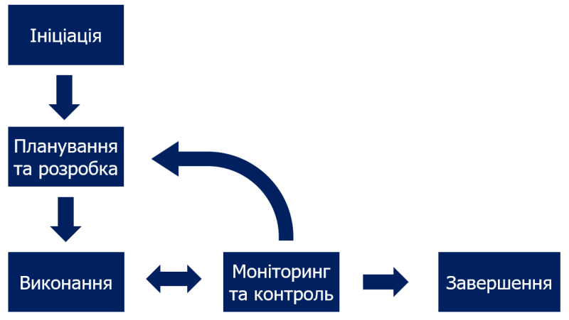

# Система управління проектами. Аналіз предметної області

## Вступ

В цьому документі проводиться аналіз систем управління проектами. Зазначені основні визначення, такі як: систему управління проектами, управління проектами, проект, робота, віха, мережева діаграма, життєвий цикл проекту. Будуть вирішені підходи та способи вирішення завдання, проведені порівняльні характеристики існуючих засобів вирішення завдання та буде сформований висновок.

## Основні визначення

**Управління проектами** — це процес управління командою, ресурсами проекту за допомогою спеціальних методів та прийомів з метою успішного досягнення поставленої мети.

**Система управління проектами** — це програми та онлайн-сервіси, які допомагають планувати завдання, складати розклад, розподіляти ресурси, відслідковувати ефективність роботи кожного фахівця та всієї команди.

**Життєвий цикл проекту** – це період часу від задуму проекту до його закінчення, який може характеризуватися моментом здійснення перших витрат за проектом (поява проекту) й отриманням останньої вигоди (ліквідація проекту).

**Життєвий цикл ПЗ** - сукупність окремих етапів робіт, що проводяться у заданому порядку протягом періоду часу, який починається з вирішення питання про розроблення програмного забезпечення і закінчується припиненням використання програмного забезпечення

**Віха** (millestone) - термін, що використовується в управлінні проєктами і означає важливе місце, ключовий етап, перехід на нову стадію розвитку проєкту. Зазвичай, цим важливим етапом є завершення якогось ключового завдання, підписання важливих документів або ж будь-які інші важливі дії, що передбачаються планом проєкту. Перехід цієї контрольної точки призводить до змін у всьому проєкті.

**Спринт** (sprint) – це короткий часовий інтервал, протягом якого scrum-команда виконує заданий обсяг роботи.

**Планування спринту** (sprint planning) – це зустріч на початку спринту, на якій команда та власник продукту (ВП) обговорюють та приймають рішення про те, яка робота буде виконана у спринті, її обсяг та способи виконання.

**Беклог продукту** (product backlog) — це впорядкований набір елементів, черга завдань, перелік всіх функцій, які хочуть одержати зацікавлені люди від продукту. Цей список містить короткі описи всіх бажаних можливостей продукту.

**Канбан-дошка** є одним з інструментів, який може використовуватися при впровадженні методу управління розробкою «Канбан». Вона допомагає наочно подати завдання, обмежити обсяг незавершеної роботи і досягти максимальної ефективності (або швидкості).

 **Артефакт** – це результат певної роботи, який можна використовувати в процесі розробки програм, або який є кінцевою метою розробки. Це поняття є досить абстрактним, але на практиці під артефактами розуміють і діаграми, і  бібліотеки, які необхідні для розробки проекту, і модулі, з яких складається проект, і сам проект у готовому для використання вигляді теж вважається артефактом.

**Система керування версіями** —  це система, що записує зміни у файл або набір файлів протягом деякого часу, так що ви зможете повернутися до певної версії пізнише. 

**Сховище документів** (repository) - місце, де система управління версіями зберігає всі документи разом з історією їх зміни та іншої службової інформацією.

**Гілка** (branch) - це копія частини (як правило, одного каталогу) сховища, в яку можна вносити свої зміни, які не впливають на інші гілки. Документи в різних гілках мають однакову історію до точки розгалуження і різні - після неї.

**Мережевий графік** (або Діаграма Ганта) - це популярний вид діаграми, який використовується для планування і контролю виконання проекту. Такий інтерактивний мережевий графік присутній практично у всіх системах управління проектами.

## Підходи та способи вирішення завдання

### Опис моделей та методологій розробки ПЗ

У програмного забезпечення, як у живої істоти є свій життєвий цикл. Життєвий цикл ПЗ - це стадії, що проходить програмний продукт від появи ідеї до її реалізації в коді, імплементації у бізнес і подальшої підтримки. Моделі життєвого циклу багато в чому зумовлюють і методології розробки ПЗ.

Зазвичай до етапів життєвого циклу відносять:

+ Аналіз вимог
+ Проектування
+ Програмування
+ Тестування і налагодження
+ Експлуатацію, супровід і підтримку

За великим рахунком всі моделі можна розділити на дві великі групи: послідовні та ітераційні моделі.

**Waterfall** (каскадна модель)

Основна суть моделі Waterfall у тому, що етапи залежать один від одного і наступний починається, коли завершений попередній, утворюючи таким чином каскадний рух уперед. Команди різних етапів між собою не комунікують, кожна команда відповідає чітко за свій етап. Недоліками цієї моделі є отримання результату по проходженню всіх етапів і складність виявлення помилок. Повертатися назад важко. Не зрозуміло що повертати: якщо стався збій на якомусь етапі, його наслідки видно тільки в кінці. Найпростіший спосіб зробити проєкт більш керованим - це розбити процес його виконання на послідовні етапи. Саме на такій структурі базується традиційний метод управління проєктами.

#### Ітераційна, інкрементна моделі й спіральна моделі 

**Ітераційна модель** передбачає розбиття проекту на частини (ітерації) і проходження етапів життєвого циклу на кожному з них. Ця модель не потребує для початку повної специфікації вимог. Замість цього, створення починається з реалізації частини функціональності, що стає базою для визначення подальших вимог. Цей процес повторюється. Версія може бути неідеальною, головне, щоби вона працювала. Потрібно розуміти кінцеву ціль і прямувати до неї так, щоби кожен крок був результативним, а кожна версія - працеспроможною. Даний підхід дозволяє боротися з невизначеністю, знімаючи її етап за етапом, і перевіряти правильність технічного, маркетингового або будь-якого іншого рішення на ранніх стадіях.

Спіральна й інкрементна моделі є різновидами ітераційної моделі життєвого циклу ПЗ.

**Інкрементна модель** передбачає розширення можливостей, добудовування модулів і функцій програми. В інкрементній моделі повні вимоги до системи діляться на різні збірки. Поетапна розробка ПЗ. Є декілька циклів розробки і разом вони складають життєвий цикл “мульти-каскад”. Цикл розділений на менші модулі. Кожен модуль проходить через фази визначення вимог, проектування, кодування, введення і тестування. Процедура розробки по інкрементній моделі передбачає випуск на першому великому етапі продукту в базовій функціональності, а потім у поступовому додаванні нових функцій (“інкрементів”). Процес повторюється, поки не буде створена повна система.

**Спіральна модель** передбачає, що усі етапи життєвого циклу йдуть витками. Такий процес відображає суть назви: піднімаючись, проходиться один виток (цикл) спіралі для досягнення кінцевого результату. Ця модель схожа на інкрементну, але з акцентом на аналіз ризиків. Вона добре працює для вирішення критично важливих бізнес задач, коли невдача несумісна з діяльністю компаній, в умовах випуску нових продуктових лінійок, при необхідності наукових досліджень і практичної апробації.

#### Agile принципи розробки ПЗ

**Agile** — родина ідей гнучкої розробки, а не єдиний підхід в розробці програмного забезпечення, і визначається Agile Manifesto. Agile не включає практик, а визначає цінності та принципи, якими керуються успішні команди. Тобто Agile - це не модель і не методологія, а набір принципів, на основі яких можна будувати моделі та методології.

Основні ідеї **Agile**:

1. люди і взаємодія важливіші за процеси та інструменти;
2. працюючий продукт важливіший за вичерпну документацію;
3. співпраця з замовником важливіше узгодження умов контракту;
4. готовність до змін важливіше проходження попереднім планом.

Принцип взаємодії має на увазі, що замовник взаємодіє з командою, команда з замовником - усі між собою. Однак взаємодії всіх і з усіма можуть вилитися у хаос, що впливає на всі сфери розробки. Тому використовуючи Agile потрібно розуміти обмеження: команди повинні бути невеликі, учасники повинні бути компетентні та мотивовані, ітерації короткі з максимально зрозумілими цілями, встановлені чіткі обмеження за часом і кінцевий результат повинен бути очевидним.

Основні методології, що базуються на ідеях **Agile**:

**Scrum** методологія ґрунтується на понятті спринту (sprint), протягом якого виконується робота над продуктом. Перед початком кожного спринту проводиться планування (Sprint Planning), на якому проводиться оцінка вмісту списку завдань із розвитку продукту (Product Backlog) і формування беклога на спринт (Sprint Backlog), у рамках яких і діє команда. Для спринту завжди існують обмеження по часу, зазвичай від тижня до місяця. Тривалість у спринті фіксована, але команда вибирає її самостійно на початку проекту, виходячи з проекту і власної продуктивності. В кінці спринту замовнику видається робочий інкремент продукту – найважливіші «частини», які вже можна використовувати. Наприклад, сайт з частиною функціональності або програма, яка вже працює, нехай і частково. Після цього команда проекту приступає до наступного спринту.

**Lean** підхід полягає в тому, що ми ощадливо ставимося до ресурсів (у тому числі часу) і вирішуємо завдання найпростішим способом. Lean-підхід не про "технічні" проблеми і їхні рішення інженерними засобами, а про підприємницькому підході до вирішення завдань.Lean передбачає, що команда шукає найпростіше рішення для досягнення результату: технічно, організаційно і т.п., спрощуючи все, що не є дійсно важливим. У спрощенні сила і головна "пастка" Lean: прагнення все спростити іноді призводить до ситуацій, в яких продукт спрощують настільки, що губляться дійсно важливі функції і продукт по суті виявляється непотрібним, оскільки не несе цінності користувачеві.

**Kanban** створений інженером компанії Toyota Taiichi Ono в 1953 році, Kanban дуже схожий на схему промислового виробництва. На вході в цей процес потрапляє шматочок металу, а на виході виходить готова деталь. Також і в Kanban, інкремент продукту передається вперед з етапу на етап, а в кінці виходить готовий до постачання елемент. За kanban методологією проект ділиться на етапи, що візуалізуються у вигляді канбан-дошки. Завдання у вигляді "карток" переміщуються з етапу на етап. Нові завдання можна додавати у будь-який час. Завдання закривається не по закінченню конкретного часу, а по зміні статусу на "завершено". Kanban — методологія з концепції "ощадливого виробництва".

### Артефакти у розробці ПЗ

Артефакт - це будь-який штучно створений елемент програмної системи. До елементів артефактів, можуть належати файли, вихідні тексти, веб сторінки, довідкові файли, супровідні документи, файли з даними, моделі та багато іншого, що є фізичним носієм інформації. Іншими словами, артефактами є ті інформаційні елементи, які тим чи іншим способом використовуються під час роботи програмної системи та входять до її складу.

У системі позначень UML артефакт подається у вигляді прямокутної піктограми з ключовим словом "артефакт", що розташовується над його ім'ям. Наявність явно заданого імені – обов'язковий атрибут артефакту. Ім'я артефакту може бути як простим у вигляді текстового рядка, так і кваліфікованим з уточненням у вигляді імені пакета, в якому міститься цей артефакт.

Як правило артефакти поділяють на:

+ Артефакти розміщення (deployment artifacts) — динамічні бібліотеки та вихідні коди програм, класичні та альтернативні об'єктні моделі.

+ Артефакти робочих продуктів (work product artifacts) — результати процесу розробки програмного продукту, які безпосередньо не беруть участь у роботі створеного програмного додатку, але вони є результатами розробки. Наприклад файли вихідного коду і файли даних, із яких вже створюються артефакти розміщення.

+ Артефакти виконання (execution artifacts), які динамічно виникають у ході виконання програмного продукту, наприклад об'єкти .NET, які генеруються з DLL.

## Порівняльна характеристика існуючих засобів вирішення завдання

 

    

        Умовні позначення до таблиці:
    

+ ✅ - функція вдало реалізована
+ ❌ - функція не реалізована або реалізована невдало

| Вимога | Критерій | GitHub Projects | Trello | Basecamp | Nifty | Backlog | Asana |
|:------| :------: | :-------------: | :----: | :------: | :---: | :-----: | :---: |
| Функціональність |
|  | Система нагадувань | ✅ | ✅ | ✅ | ✅ | ✅ | ✅ |
|  | Instant Messaging | ✅ | ❌ | ✅ | ✅ | ✅ | ✅ |
|  | Offline доступ | ✅ | ❌ | ❌ | ❌ | ❌ | ❌ |
|  | Наявність API | ✅ | ✅ | ✅ | ✅ | ✅ | ✅ |
|  | Історія редагування завдань | ✅ | ✅ | ✅ | ✅ | ✅ | ✅ |
|  | Розширений пошуковий фільтр | ✅ | ✅ | ✅ | ✅ | ✅ | ✅ |
|  | Можливість задати дедлайни | ✅ | ✅ | ✅ | ✅ | ✅ | ✅ |
|  | Підтримка артефактів | ❌ | ❌ | ❌ | ❌ | ❌ | ❌ |
| Зручність |
|  | Інтеграція з GitHub | ✅ | ✅ | ❌ | ✅ | ✅ | ✅ |
|  | User-friendly інтерфейс | ✅ | ✅ | ✅ | ✅ | ✅ | ✅ |
|  | Кросплатформеність | ✅ | ✅ | ✅ | ✅ | ✅ | ✅ | 
|  | Багатомовність | ❌ | ✅ | ❌ | ❌ | ❌ | ❌ |
|  | Зручні гарячі клавіші | ✅ | ✅ | ✅ | ✅ | ✅ | ❌ |
|  | Наявність мобільного додатку | ❌ | ✅ | ✅ | ✅ | ✅ | ✅ |
| Надійність |
|  | Регулярні оновлення системи | ✅ | ✅ | ✅ | ✅ | ✅ | ✅ |
|  | Можливість резервного копіювання | ✅ | ✅ | ✅ | ❌ | ✅ | ✅ |
|  | Конфіденційність приватної інформації | ✅ | ✅ | ✅ | ✅ | ✅ | ✅ |
| Продуктивність |
|  | Швидкість інтерфейсу | ✅ | ✅ | ✅ | ✅ | ✅ | ✅ |
|  | Стійкість до збоїв | ✅ | ✅ | ✅ | ✅ | ✅ | ✅ |
| Підтримка |
|  | Цілодобова онлайн підтримка | ✅ | ✅ | ✅ | ✅ | ✅ | ✅ |
|  | Зворотній зв’язок | ✅ | ✅ | ✅ | ✅ | ✅ | ✅ |
|  | FAQ | ✅ | ✅ | ✅ | ✅ | ✅ | ✅ |

### [GitHub Projects](https://github.com/features/issues) ###

**GitHub Projects** - це функція управління issues в GitHub, яка допомагає вам організовувати issues та розміщувати pull requests на дошці стилю Kanban для кращої візуалізації та визначення пріоритетів роботи. Ви можете створити скільки завгодно проектів у сховищі. Інтерфейс GitHub Projects дозволяє візуалізувати прогрес та завдання проекту, який можна використовувати разом із issues та pull requests, щоб відстежувати роботу, яку необхідно виконати. Система є зручною у використанні та при цьому легко розуміються користувачами.

### [Trello](https://trello.com/) ###

 **Trello** - безкоштовна багатоплатформна система управління проектами. Проекти зображуються дошками, що містять списки. Списки містять картки, якими зображуються задачі. Картки повинні переходити з попереднього списку до наступного (за допомогою перетягування), таким чином зображаючи рух якоїсь функції від ідеї, аж до тестування. Картці може бути присвоєно відповідальних за неї користувачів. Користувачі та дошки можуть об'єднуватись в команди. Trello має обмежену підтримку тегів у вигляді шести кольорових міток. Картки можуть містити коментарі, вкладення, дату завершення та переліки (списки підзадач). Інтерфейс програми працює в форматі drag-and-drop, всі дані оновлюються динамічно на фоні.
Даний трекер корисний стартапам, малому бізнесу, самозайнятим фахівцям, соціальним проектам, різним проектним командам.

### [Basecamp](https://basecamp.com/) ###

**Basecamp** - онлайн-сервіс для управління проектами, спільної роботи і постановки завдань по проектам. Сервіс об'єднує в собі інструменти для комунікації, відстеження завдань, планування і передачі файлів. Дана система дуже проста у використанні, але разом з простотою їй гостро бракує життєво важливого функціонала для того, щоб її можна було використовувати в серйозних, більш-менш великих проєктах. Все спілкування відбувається у вигляді блогу, завдання ставляться як to-do списки, що зручно тільки в разі якихось загальних описів для розвитку проєкту.

### [Nifty](https://niftypm.com/) ###

**Nifty** - це інструмент управління проектами на новій хвилі, який скорочує цикли розробки проектів та покращує продуктивність команди шляхом об’єднання всіх важливих функцій управління проектами в одному програмному забезпеченні. Кінцевий результат - це прогрес, який керується [віхами](https://uk.wikipedia.org/wiki/%D0%92%D1%96%D1%85%D0%B0_(%D1%83%D0%BF%D1%80%D0%B0%D0%B2%D0%BB%D1%96%D0%BD%D0%BD%D1%8F_%D0%BF%D1%80%D0%BE%D1%94%D0%BA%D1%82%D0%B0%D0%BC%D0%B8)), завдяки чому команди надихаються, гарантуючи, що організаційні цілі залишаться у встановленому графіку. Програмне забезпечення Nifty дозволяє керувати завданнями як у форматі Kanban, так і у вигляді списку, має вбудований календар, який можна інтегрувати з Google, а також обмін файлами та документами.

### [Backlog](https://backlog.com/) ###

**Backlog** - це хмарне рішення для управління проектами та відстеження проблем, яке призначене для команд розробників, які працюють із командами дизайнерів, маркетологів та ІТ. До ключових особливостей рішення відносяться управління проектами та проблемами, підзадачами, відстеження помилок та вичерпані діаграми. Backlog пропонує такі функції, як списки спостереження, обмін файлами та потоки коментарів. Він інтегрується з Git та SVN, що допомагає розробникам керувати вихідним кодом проекту разом із завданнями проекту. Backlog дозволяє користувачам візуалізувати свій щоденний графік і робочі процеси проекту за допомогою діаграм Ганта. Він також допомагає користувачам пропонувати та порівнювати зміни у проекті, коментувати запити на витяг, відстежувати зміни, що відбуваються у проекті, та документувати зміни.

### [Asana](https://asana.com/) ###

**Asana** - онлайн-сервіс для командної роботи над проектами, відстеженням завдань, вибудовування комунікації в команді і обміну документами. Кожна команда може створити для себе зручний робочий простір (workspace). Робочий простір може включати в себе безліч проектів, а кожен проект, в свою чергу, безліч завдань. Користувачі, що мають на те повноваження, можуть доповнювати завдання, додавати коментарі і теги, прикріплювати до задачі файли. Відмінною рисою Asana від інших програм для управління проектами є її гнучкість. Систему можна використовувати для відстеження поточної роботи та довгострокових проектів, а також для координації команд та розподілу робочого навантаження між працівниками. Широкий спектр можливостей системи надає свободу у використанні під потреби користувачів.

## Висновки

*[Робляться висновки щодо доцільності розробки нової або модифікації існуючої інформаційної системи, необхідності та способів інтеграції з системами(сервісами) третіх сторін, тощо.]*

## Посилання

https://uk.wikipedia.org/wiki/Управління_проєктами#Методи_управління_проєктами

https://www.atlassian.com/ru/agile/project-management

https://www.pmservices.ru/project-management-news/top-7-metodov-upravleniya-proektami-agile-scrum-kanban-prince2-i-drugie/

https://blog.agrokebety.com/shcho-take-upravlinnya-proektamy

