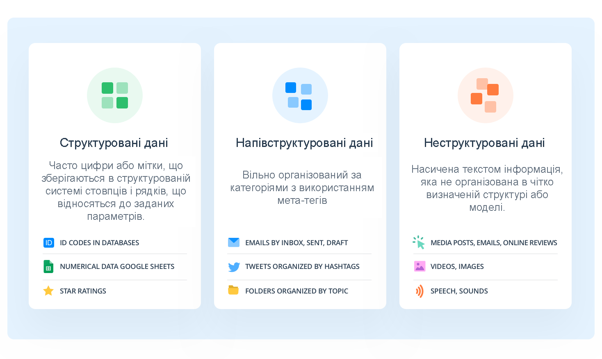
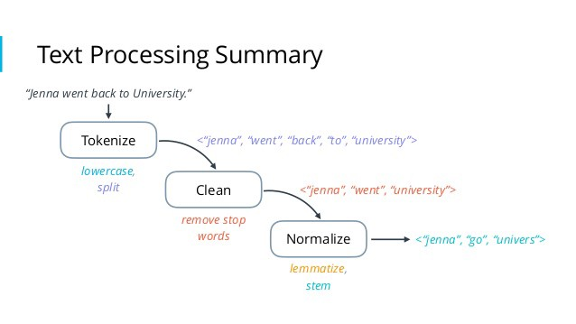
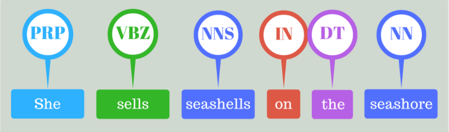
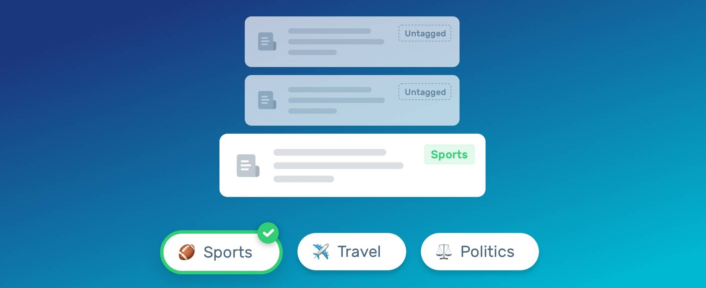

# Аналіз предметної області

## Вступ

У цьому документі містяться основні терміни, підходи та способи вирішення завдань, порівняльна характеристика існуючих засобів для порівняння медіа-контенту, а саме Semantrum, Isentia, BRAND24, Meltwater, YouScan та Brandwatch, висновки і посилання на інформацію, потрібну для аналізу.

## Основні визначення

**База даних**  - сукупність даних, організованих відповідно до концепції, яка описує характеристику цих даних і взаємозв'язки між їх елементами; ця сукупність підтримує щонайменше одну з областей застосування. В загальному випадку база даних містить схеми, таблиці, подання, збережені процедури та інші об'єкти.[[1]](./state-of-the-art.html#висновки)

**Медіа контент**  - це інформація, яка міститься в засобах комунікації. Це включає в себе Інтернет, кіно, телебачення, радіо, аудіо компакт-диски, книги, журнали, фізичне мистецтво та живий контент. Він спрямований на кінцевого користувача або аудиторію в секторах видавництва, мистецтва та комунікацій.[[2]](./state-of-the-art.html#висновки)

**Аналітика**  - основа інтелектуальної, логіко-мисленевої діяльності, спрямованої на рішення практичних завдань. У її основі лежить не стільки принцип констатації фактів, скільки принцип «випередження подій», що дозволяє організації або індивідові прогнозувати майбутній стан об'єкту аналізу.[[3]](./state-of-the-art.html#висновки)

**Бібліотека(програмування)**  - збірка об'єктів чи підпрограм для вирішення близьких за тематикою задач. У залежності від мови програмування бібліотеки містять об'єктні модулі чи сирцевий код та дані, допоміжні для задіяння та інтеграції нових можливостей в програмні рішення.[[4]](./state-of-the-art.html#висновки)

**Машинне навчання**  - це підгалузь штучного інтелекту в галузі інформатики, яка часто застосовує статистичні прийоми для надання комп'ютерам здатності «навчатися» (тобто, поступово покращувати продуктивність у певній задачі) з даних, без того, щоби бути програмованими явно.[[5]](./state-of-the-art.html#висновки)

**Відкритий код**  - принцип «розподіленої» розробки, що використовується в технології, мистецтві, політиці громадських організацій та мереж, а насамперед — у створенні вільного програмного забезпечення.[[6]](./state-of-the-art.html#висновки)

**FAQ**  - підбірка часто задаваних питань на певну тему та відповідей на них, яка створюється переважно для того, щоб не треба було постійно відповідати на одні й ті ж запитання, часто нудні для того, хто відповідає.[[7]](./state-of-the-art.html#висновки)

## Підходи та способи вирішення завдання

Основним елементом навколо якого відбуваються всі процеси є дані. Хто володіє інформацією, той володіє світом! Тому задля розширення сфери впливу наш проєкт ґрунтується на **Data mining**. Це техніка дослідження, яка використовує обчислювальний аналіз для виявлення закономірностей у великих наборах даних. Методи data mining варіюються від програм машинного навчання до ГІС і картографування, а також бізнес-аналітики. Діапазон типів даних ускладнює визначення методів аналізу даних.[[8]](./state-of-the-art.html#висновки)

Медіаконтент зазвичай подається у зрозумілій для людини формі тексту, інколи обрамленій у вигляді аудіо або відео контенту. Все це інтерпретується комп'ютером як неструктурований текст. **Text mining** вирішує спектр таких задач перетворюючи неструктурований текст в структурований формат для  подальшого виявлення закономірностей і нових тенденцій.

Текст є одним із найпоширеніших типів даних у БД. Залежно від бази даних ці дані можуть бути організовані наступним чином:[[9]](./state-of-the-art.html#висновки)

- Структуровані дані: ці дані стандартизовані в табличному форматі з численними рядками та стовпцями, що полегшує їх зберігання й обробку для аналізу та алгоритмів машинного навчання. Структуровані дані можуть містити такі вхідні дані, як імена, адреси та номери телефонів.
- Неструктуровані дані: ці дані не мають попередньо визначеного формату даних. Він може включати текст з таких джерел, як соціальні мережі або огляди продуктів, або мультимедійні формати, такі як відео- та аудіофайли.
- Напівструктуровані дані: як випливає з назви, ці дані являють собою суміш структурованих і неструктурованих форматів даних. Хоча у нього є певна організація, у нього недостатньо структури, щоб відповідати вимогам реляційної бази даних. Приклади напівструктурованих даних включають файли XML, JSON і HTML.

*[Pic.1. What Is Unstructured Data](https://monkeylearn.com/blog/what-is-unstructured-data/)*

Перш ніж застосовувати різні методи інтелектуального аналізу тексту, ви повинні почати з попередньої обробки тексту, яка є практикою очищення та перетворення текстових даних у придатний для використання формат. Ця практика є основним аспектом **Natural Language Processing** (або NLP) — це компонент видобутку тексту, який виконує особливий вид лінгвістичного аналізу, який по суті допомагає машині «читати» текст.[[10]](./state-of-the-art.html#висновки) 

*[Pic.2. Natural Language Processing (NLP) based Chatbots](https://medium.com/analytics-vidhya/natural-language-processing-nlp-based-chatbots-7b2436428256)*

NLP використовує різні методології для розшифровки неоднозначності в людській мові, включаючи наступні:

- **Tokenization**: Це процес розбиття довгого тексту на речення та слова, які називаються "токенами". Потім вони використовуються в моделях, таких як bag-of-words, для кластеризації тексту і завдань зіставлення документів.[[9]](./state-of-the-art.html#висновки)

- **Stemming**: Це процес відділення префіксів і суфіксів від слів для отримання форми та значення кореня слова. Цей метод покращує пошук інформації шляхом зменшення розміру індексованих файлів.[[9]](./state-of-the-art.html#висновки)

- **Summarization**: Цей метод забезпечує короткий виклад довгих фрагментів тексту для створення короткого, зв'язного резюме основних положень документа.[[2]](./state-of-the-art.html#висновки)

[Pic.3. Email Classification Using Natural Language Processing (NLP)](https://medium.datadriveninvestor.com/email-classification-using-natural-language-processing-nlp-ee3573bc79f7)

- **Part-of-Speech (PoS) tagging**: Цей метод присвоює тег кожному токену в документі на основі його частини мови, тобто позначає іменники, дієслова, прикметники тощо. цей крок дозволяє проводити семантичний аналіз неструктурованого тексту.[[9]](./state-of-the-art.html#висновки)

*[Pic.4. Learning POS Tagging & Chunking in NLP](https://medium.com/greyatom/learning-pos-tagging-chunking-in-nlp-85f7f811a8cb)*

- **Text categorization**: Ця задача, яка також відома як text classification, відповідає за аналіз текстових документів і їх класифікацію на основі зумовлених тим або категорій. Ця підзадача особливо корисна при категоризації синонімів і скорочень.[[9]](./state-of-the-art.html#висновки)

*[Pic.5. Text Classification: What it is And Why it Matters](https://monkeylearn.com/text-classification/)*

- **Sentiment analysis**: Використання цього підходу дозволяє нам визначати позитивні або негативні настрої з внутрішніх або зовнішніх джерел даних, дозволяючи відстежувати зміни щодо об'єктів за якими ми слідкуємо з плином часу. Він зазвичай використовується для надання інформації про сприйняття аудиторією різних брендів, продуктів і послуг. Ці аналітичні дані можуть спонукати компанії встановлювати контакти з клієнтами, покращувати внутрішні процеси та користувальницький досвід.[[9]](./state-of-the-art.html#висновки)

*[Pic.6. Email Sentiment Analysis in 3 Steps](https://monkeylearn.com/blog/email-sentiment-analysis/)*

- **Named-entity recognition** (NER) також відомий як entity identification або  entity extraction, метод спрямований на пошук і категоризацію певних сутностей в тексті, таких як імена або локації. Наприклад, NER визначає "Київ" як місцеположення, а "Марія" - як жіноче ім'я.[[10]](./state-of-the-art.html#висновки)

*[Pic.7. Named Entity Recognition: Concept, Tools and Tutorial](https://monkeylearn.com/blog/named-entity-recognition/)*

- **Full Text Search** належить до методів пошуку текстового вмісту в документі або колекції документів, що містять текстовий вміст. Система Full Text Search перевіряє весь текстовий вміст документів, намагаючись знайти відповідність одному пошуковому запиту або декільком термінам, причому аналіз тексту є ключовим компонентом.[[11]](./state-of-the-art.html#висновки)

- **Word2vec** - в цьому підході модель створює векторний простір, як правило, з декількох сотень вимірювань, з кожним унікальним словом у множині таким чином, що слова, які мають спільні контексти в множині, розташовані близько один до одного в просторі. Це можна зробити, використовуючи 2 різних підходи: починаючи з одного слова, щоб передбачити його контекст (*Skip-gram*) або починаючи з контексту, щоб передбачити слово (*Continuous Bag-of-Words*).[[12]](./state-of-the-art.html#висновки)

- **Deep Learning** - це підвид машинного навчання, який навчає комп'ютер виконувати людиноподібні завдання, такі як розпізнавання мови, ідентифікацію зображень і складання прогнозів. Це покращує здатність класифікувати, розпізнавати, виявляти та описувати дані за допомогою. У Text mining цей метод можна застосовувати для кластеризації та класифікації тексту, з допомогою Deep Learning легко знайти потрібну текстову інформацію.[[13]](./state-of-the-art.html#висновки)

- **Tensor Flow** - це потужна бібліотека з відкритим кодом для машинного навчання, розроблена компанією Google. В основному використовується для глибокого навчання, підтримує розширену класифікацію тексту, Узагальнення, позначку і завдання розпізнавання мови. Оскільки це дає вам можливість аналізувати дані у величезних масштабах, великі компанії вибирають TensorFlow для побудови своїх моделей.[[14]](./state-of-the-art.html#висновки)

- **Data Sampling** - це техніка статистичного аналізу, яка використовується для відбору, обробки та аналізу репрезентативної підмножини точок даних для виявлення закономірностей і тенденцій у більшому наборі даних, що досліджується. Це дає змогу спеціалістам з аналізу даних, розробникам прогнозних моделей та іншим аналітикам даних працювати з невеликою, керованою кількістю даних, щоб швидше створювати та запускати аналітичні моделі, водночас одержуючи точні результати.[[21]](./state-of-the-art.html#висновки) 

*[Pic.8. NLP with gensim (word2vec)](samyzaf.com/ML/nlp/nlp.html)*

## Порівняльна характеристика існуючих засобів вирішення завдання

### Існуючі засоби для аналізу медіа-контенту які будуть порівнюватися:

**Semantrum** [[15]](./state-of-the-art.html#висновки) - це онлайн система медіа-моніторингу та управління репутацією. Вона надає цілодобовий моніторинг згадок та аудит репутації у ЗМІ, веб-джерелах, соціальних мережах з детальною аналітикою, візуалізацією та відслідковуванням динаміки за персональними метриками. Моніторинг брендів, персон, подій чи будь-яких ключових слів.

**BRAND24** [[16]](./state-of-the-art.html#висновки) - це інструмент, який допомагає компаніям відстежувати та залучати людей, а також медіакомпанії, які розповідають про свій бізнес. Клієнти можуть використовувати платформу для аналізу розмов про свої бренди, продукти та конкурентів, а також отримати свіжу інформацію про свою клієнтську базу.

**Isentia** [[17]](./state-of-the-art.html#висновки) - надає вам цілодобовий 365-денний доступ до всього вашого друкованого, онлайнового, телевізійного, радіо та соціальних медіа-контенту з настроюваними сповіщеннями, інтегрованим медіа-плеєром і функціями, готовими до спільного доступу. Призначений для зайнятих професіоналів, які хочуть тримати руку на пульсі будь-якого важливого висвітлення за допомогою швидкого та надійного моніторингу медіа.

**Meltwater** [[18]](./state-of-the-art.html#висновки) - один з лідерських продуктів на американському ринку в галузі онлайн-моніторингу ЗМІ та медіа-аналітики. Програмне забезпечення Meltwater виділяється як одне з найбільш повних універсальних рішень для фахівців зі зв'язків з громадськістю (PR), комунікацій та маркетингу.

**YouScan** [[19]](./state-of-the-art.html#висновки) - це платформа для аналітики соціальних медіа на базі штучного інтелекту з найкращими в індустрії можливостями аналізу зображень. Можливості YouScan дозволяють розпізнавати лого, об'єкти, сцени, активності та демографічну інформацію на зображеннях.

**Brandwatch** [[20]](./state-of-the-art.html#висновки) - платформа для збирання та аналізу данних з блогів, форумів, сайтів для відгуків, та соціальних мереж.

### Порівняльна характеристика властивостей FURPS:

- 🟢 - Повністю задовільняє критерій
- 🟡 - Частково задовільняє критерій
- 🔴 - Не задовільняє критерій
- ⚪️(🟢/🟡/🔴) - В процесі розробки(в дужках запланований результат)

|Вимоги| Критерії                      | Semantrum | BRAND24 | Isentia | Meltwater | YouScan | Brandwatch | Our system |
|:----:| :--------------: | :-------: | :----: |  :----:  | :-----: | :----: | :--------: | :--------: |
| **Functionality (функциональні вимоги)** |
|  | Особистий кабінет                 | 🟢       | 🟢         | 🟢     |  🟢       | 🟢     |  🟢      | ⚪️(🟢) |
|  | Візуалізація даних                | 🟢       | 🟢         | 🟢     |  🟢       | 🟢     |  🟢      | ⚪️(🟢) |
|  | Моніторинг ЗМІ                    | 🟢       | 🟢         | 🟢     |  🟢       | 🟢     |  🟢      | ⚪️(🟢) |
|  | Моніторинг соціальних мереж       | 🟢       | 🟢         | 🟢     |  🟢       | 🟢     |  🟢      | ⚪️(🟢) |
|  | Сповіщення                        | 🟢       | 🟢         | 🟢     |  🟢       | 🟢     |  🟢      | ⚪️(🟡) |
|  | Інтеграція з месенджерами         | 🟢       | 🔴         | 🟢     |  🟢       | 🟢     |  🔴      | ⚪️(🟡) |
| **Usability (вимоги до зручності роботи)** |
|  | Мови | Ukrainian, English, Russian | English | English, Indonesian, Singaporian | English, Deutsch, Français, Nederlands, Suomi, 日本語, 中文      | English, Ukrainian, Russian, Español | Deutsch, English, Español, Français | ⚪️(Ukrainian, English) |
|  | Ціна | Simple plan $150/m       | Individual plan $49/m | $299/m | Price based on your requirements | Price per feature | Price based on your requirements | ⚪️(Free) |
|  | Наявність демо-доступу            | 7d       | 14d         | Demo period depends on your purpose |  🔴       | 1m    | 🔴   | ⚪️(Free) |
|  | Зручність інтерфейсу              | 🟡       | 🟢         | 🟢     |  🟢       | 🟢     |  🟢      | ⚪️(🟢) |
|  | Зручність користування з телефону | 🟡       | 🟢         | 🟢     |  🟢       | 🟢     |  🟢      | ⚪️(🟡) |
| **Reliability (вимоги до надійності)** |
|  | Крупні бренди в ролі клієнтів     | 🟢       | 🟡         | 🟢     |  🟢       | 🟢     |  🟢      | ⚪️(🔴) |
|  | Захист даних                      | 🟢       | 🟢         | 🟢     |  🟢       | 🟢     |  🟢      | ⚪️(🟡) |
| **Performance (вимоги до продуктивності)** |
|  | Швидкість роботи                  | 🟡       | 🟢         | 🟢     |  🟢       | 🟢     |  🟢      | ⚪️(🟡) |
|  | Оптимізация інтерфейсу            | 🟡       | 🟢         | 🟢     |  🟢       | 🟡     |  🟢      | ⚪️(🟡) |
| **Supportability (вимоги до підтримки)** |
|  | Служба підтримки                  | 🟢       | 🟢         | 🟢     |  🟢       | 🟢     |  🟢      | ⚪️(🔴) |
|  | FAQ                               | 🟢       | 🟢         | 🟢     |  🟢       | 🟢     |  🟢      | ⚪️(🔴) |

## Висновки

Після аналізу існуючих засобів для вирішення проблем, зроблено висновок, що немає програмного забезпечення, яке б забезпечило повне вирішення даної проблеми. Враховуючи це, буде доцільним створення нового засобу для аналізу медіа-контенту, що містить у собі усі переваги існуючих засобів, та додає нові функції, які не були реалізовані у вищенаданих прикладах, або були недостантньо ефективними.

## Посилання

1. [Бази даних](https://uk.wikipedia.org/wiki/%D0%91%D0%B0%D0%B7%D0%B0_%D0%B4%D0%B0%D0%BD%D0%B8%D1%85)

2. [Media content](https://en.wikipedia.org/wiki/Content_(media))

3. [Аналітика](https://uk.wikipedia.org/wiki/%D0%90%D0%BD%D0%B0%D0%BB%D1%96%D1%82%D0%B8%D0%BA%D0%B0)

4. [Бібліотека(програмування)](https://uk.wikipedia.org/wiki/%D0%91%D1%96%D0%B1%D0%BB%D1%96%D0%BE%D1%82%D0%B5%D0%BA%D0%B0_%D0%BF%D1%96%D0%B4%D0%BF%D1%80%D0%BE%D0%B3%D1%80%D0%B0%D0%BC)

5. [Машинне навчання](https://uk.wikipedia.org/wiki/%D0%9C%D0%B0%D1%88%D0%B8%D0%BD%D0%BD%D0%B5_%D0%BD%D0%B0%D0%B2%D1%87%D0%B0%D0%BD%D0%BD%D1%8F)

6. [Відкритий код](https://uk.wikipedia.org/wiki/%D0%9F%D0%BE%D0%BB%D1%96%D1%82%D0%B8%D0%BA%D0%B0_%D0%B2%D1%96%D0%B4%D0%BA%D1%80%D0%B8%D1%82%D0%BE%D0%B3%D0%BE_%D0%BA%D0%BE%D0%B4%D1%83)

7. [FAQ](https://uk.wikipedia.org/wiki/FAQ)

8. [NYU Libraries - Text Data Mining](https://guides.nyu.edu/tdm/start)

9. [IBM Cloud Learn Hub - Text Mining](https://www.ibm.com/cloud/learn/text-mining)

10. [Natural Language Processing and Text Mining](https://www.expert.ai/blog/natural-language-processing-and-text-mining/)

11. [Text Analysis Within a Full-Text Search Engine](https://dzone.com/articles/text-analysis-within-a-full-text-search-engine)

12. [Text Classification with NLP: Tf-Idf vs Word2Vec vs BERT](https://towardsdatascience.com/text-classification-with-nlp-tf-idf-vs-word2vec-vs-bert-41ff868d1794)

13. [Deep Learning - What it is & why it matters](https://www.sas.com/en_us/insights/analytics/deep-learning.html)

14. [10 of The Best Text Mining APIs to Analyze Business Data](https://monkeylearn.com/blog/10-of-the-best-text-mining-apis-to-analyze-business-data/)

15. [Semantrum](https://promo.semantrum.net)

16. [BRAND24](https://brand24.com)

17. [Isentia](https://www.isentia.com)

18. [Meltwater](https://www.meltwater.com)

19. [YouScan](https://youscan.io)

20. [Brandwatch](https://www.brandwatch.com)

21. [Data Sampling](https://www.techtarget.com/searchbusinessanalytics/definition/data-sampling) 
