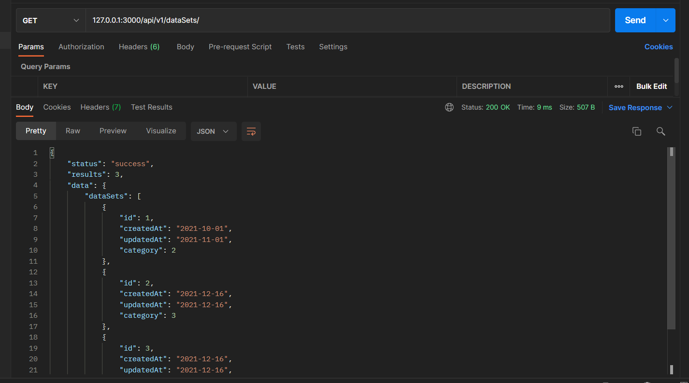
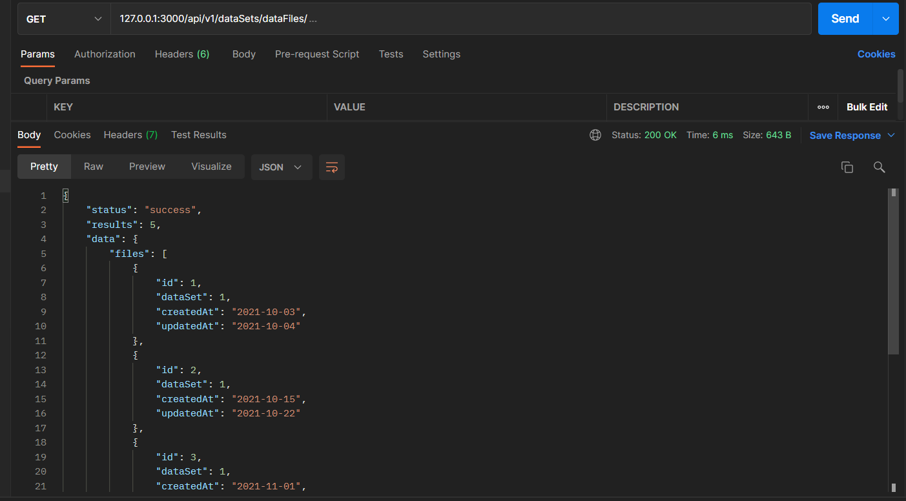
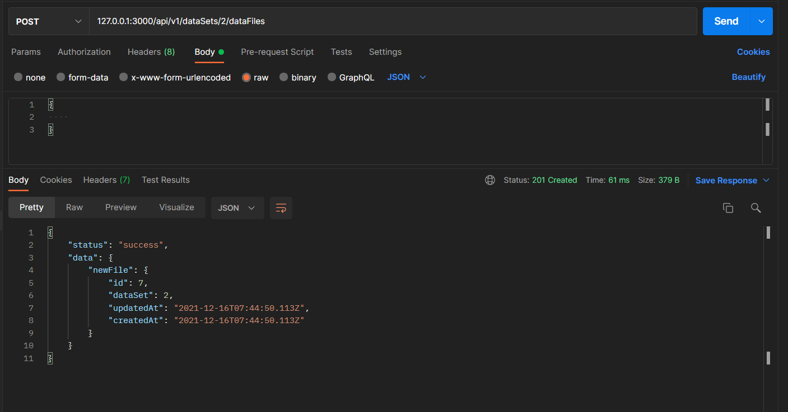

# Тестування працездатності системи

Отримати список всіх датасетів:

Отримати датасет за його ID:

Створити новий датасет:

Оновити датасет:

Видалити датасет:

Отримати список всіх файлів:

Отримати список всіх файлів датасету:

Отримати файл за його ID:

Створити новий файл:

Оновити файл:

Видалити файл:

